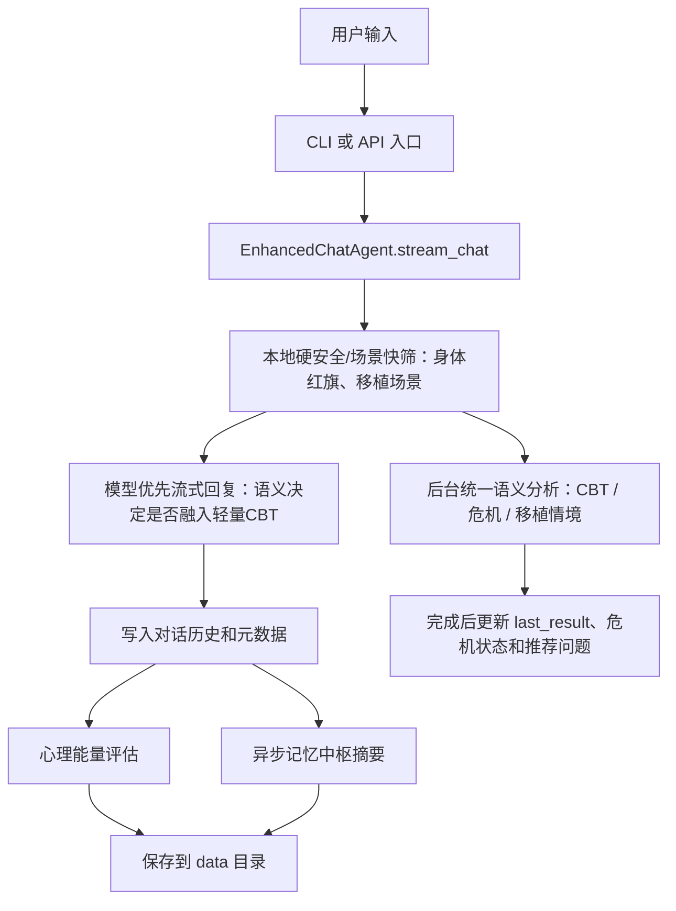

# 小芽 - 骨髓移植患者数字心理陪伴智能体

小芽是一个面向骨髓移植患者的中文心理支持智能体。当前项目同时提供命令行入口和 HTTP API 入口，核心能力包括：骨髓移植分期陪伴、CBT 认知行为疗法引导、心理能量评估、语义危机判断、对话记忆压缩和面向后端系统的流式接口。

> 说明：小芽提供心理陪伴和风险提示，不替代医生、护士、心理治疗师或紧急救援服务。真实业务接入时，危机报警必须连接院内人工处置流程。

## 当前能力

| 能力 | 当前实现 |
|---|---|
| 对话生成 | `EnhancedChatAgent.stream_chat()` 模型优先流式输出，CLI 和 API 共用该核心流程 |
| 骨髓移植分期 | 支持移植前准备期、移植中关键期、移植后恢复期；默认流式路径把命中的场景话术作为主回复提示素材，非流式路径可能直接返回模板话术 |
| CBT 支持 | 默认流式主流程不使用本地关键词/规则触发 CBT；主回复模型按用户原话语义决定是否自然融入轻量 CBT，后台统一语义分析再补充结构化结果 |
| 危机判断 | 默认不在首 token 前阻塞等待危机 LLM；心理危机由后台语义分析补充，身体红旗仍本地快速拦截 |
| 心理能量 | 记录认知成长、情绪调节、行为改变、社交连接、自我效能五个维度 |
| 记忆中枢 | 每轮后异步生成/更新摘要，下一轮只传系统提示、记忆摘要和当前问题 |
| API 会话隔离 | 每个 `sessionId` 独立持久化到 `data/sessions/<sessionId>` |
| 输出格式 | CLI/API 共用 `response_formatting.markdown_to_plain_text()`，减少 Markdown 符号进入终端或客户端 |

## 项目结构

```text
Xiaoya/
├─ Code/
│  ├─ main.py                  # 命令行入口
│  ├─ api_server.py            # Flask/SSE API 服务
│  ├─ simple_agent.py          # 智能体主流程
│  ├─ cbt_module.py            # CBT 分析与引导
│  ├─ crisis_module.py         # 危机语义判断、关键词兜底和报警记录
│  ├─ energy_model.py          # 心理能量评估与成就系统
│  ├─ transplant_support.py    # 骨髓移植分期与场景话术
│  ├─ response_formatting.py   # 共享输出清洗工具
│  ├─ keyword_library.py       # 关键词、场景标签、情绪标签
│  ├─ config.py                # 配置读取与默认值
│  └─ test_agent.py            # 综合测试
├─ File/                       # 项目参考资料
├─ data/                       # 运行数据，默认忽略提交
├─ config.env                  # 本地开发配置
├─ config.env.example          # 配置模板
├─ Agent-api.md                # API 接口说明
├─ 小芽项目技术说明文档.docx     # 面向技术人员的完整说明文档
└─ requirements.txt
```

## 快速开始

### 1. 安装依赖

```powershell
python -m venv .venv
.\.venv\Scripts\activate
pip install -r requirements.txt
```

### 2. 配置模型

复制配置模板并填写本地密钥：

```powershell
Copy-Item config.env.example config.env
```

最少需要配置：

```env
API_BASE_URL=https://api.deepseek.com
API_KEY=your_api_key_here
MODEL_NAME=deepseek-chat
DATA_DIR=data
```

开发阶段可以把真实 API key 写在 `config.env` 中。正式部署时建议改为部署平台的环境变量或密钥管理服务。

### 3. 启动命令行项目

```powershell
python Code\main.py
```

可用命令：

| 命令 | 作用 |
|---|---|
| `help` | 查看命令 |
| `phase` | 查看或设置移植分期 |
| `energy` | 查看心理能量报告 |
| `progress` | 查看综合进度报告 |
| `grounding` | 获取 5-4-3-2-1 正念落地练习 |
| `save` | 手动保存进度 |
| `load` | 加载历史数据 |
| `reset` | 重置对话和进度数据 |
| `quit` / `exit` | 退出程序 |

### 4. 启动 API 服务

```powershell
python Code\api_server.py
```

健康检查：

```powershell
curl http://127.0.0.1:8001/health
```

核心接口：

| 接口 | 方法 | 说明 |
|---|---|---|
| `/v1/psych/chat` | `POST` | 心理陪伴对话，返回 SSE 流 |
| `/v1/psych/recommendations` | `POST` | 根据阶段、能量和情绪生成推荐提问 |
| `/health` | `GET` | 服务健康检查 |

## 主流程



CLI 和 API 的关键一致性在于：两者都调用 `agent.stream_chat(message)`，结束后都调用 `agent.wait_for_background_analysis(Config.POST_STREAM_ANALYSIS_WAIT_SECONDS)`，并使用同一套结果字段 `last_result`。

默认流式请求的处理顺序：

1. 读取当前移植分期，准备本轮上下文。
2. 生成 CBT 占位分析 `semantic_background_pending`，不做本地 CBT 关键词/规则判断。
3. 危机判断默认也先占位，不在首 token 前等待危机 LLM。
4. 本地只做硬安全和轻量场景检查：身体红旗会直接返回联系医护的固定提醒；移植场景命中时只作为主回复模型的参考素材。
5. 启动后台统一语义分析 LLM-2，并立即调用主回复模型 LLM-1 流式输出。
6. 回复结束后写入历史、做心理能量评估、生成 `last_result`，并异步更新记忆中枢 LLM-3。
7. 后台语义分析如果在等待窗口内完成，就把 CBT、危机和移植情境结构化结果合并到 `last_result` 和 API `done` 事件。

## 危机判断策略

当前代码对“心理危机”默认采用语义判断，不再让关键词规则直接打断流式回复：

| 场景 | 当前策略 |
|---|---|
| 普通流式对话 | 首 token 前不等待危机 LLM，避免回复明显变慢 |
| 后台分析完成较快 | API `done` 事件中会合并最新语义危机结果 |
| 后台分析较慢 | 先完成回复，语义结果在 `last_result` 中后置更新 |
| 明显身体红旗 | 本地关键词快速提醒联系医护，如发热、胸痛、呼吸困难等 |
| 非流式语义判断 | `assess_crisis_semantic_only()` 只走 LLM，不回退关键词 |
| 传统兜底方法 | `assess_crisis()` 仍保留 LLM 失败后的关键词兜底，但不是默认流式心理危机入口 |

与速度相关的关键配置：

```env
CRISIS_LLM_DETECTION_ENABLED=true
CRISIS_LLM_STREAM_BLOCKING_ENABLED=false
POST_STREAM_ANALYSIS_WAIT_SECONDS=0.2
```

如果把 `CRISIS_LLM_STREAM_BLOCKING_ENABLED` 改成 `true`，每次回复前都会等待危机语义判断，速度会明显变慢。

## CBT 判断策略

默认 CLI 和 API 流式链路不再在首 token 前做“CBT 关键词/规则分析”，因此不会因为“总是、从来、不怕死”这类词被规则误判后强行插入 CBT 指令。主回复模型会在同一次回复生成里直接理解用户原话：如果用户表达焦虑、低落、绝望、愧疚、愤怒、灾难化或全或无思维，就自然融入一个很小的 CBT 方向引导；如果只是闲聊或事实问题，则正常回答。

后台统一语义分析仍会并行输出情绪、认知扭曲、困扰程度、推荐技术和危机分数，用于 `last_result`、API 元数据、推荐问题和后续轮次。旧的 `cbt_module` 规则分析函数仍保留在模块内作为独立模块/测试/手动降级能力，但不是 `python Code\main.py` 和 `/v1/psych/chat` 默认流式主回复的触发依据。

## API 调用示例

`/v1/psych/chat` 返回 `text/event-stream`，事件包括 `start`、多个 `delta`、最终 `done`，异常时返回 `error`。

```json
{
  "sessionId": "session-001",
  "patientContext": {
    "patientId": "p-001",
    "stage": "PRETREATMENT",
    "psychEnergy": 55
  },
  "history": [
    {"role": "user", "content": "昨天很难受"},
    {"role": "assistant", "content": "我听见你昨天真的很辛苦。"}
  ],
  "message": "今天感觉好一点了，但还是有点害怕"
}
```

最终 `done` 数据结构：

```json
{
  "reply": "模型最终回复文本",
  "energyAssessment": {
    "cognitiveGrowth": 0,
    "emotionRegulation": 0,
    "behaviorChange": 0,
    "socialConnection": 0,
    "selfEfficacy": 0,
    "totalDelta": 0,
    "hopeTreeExpDelta": 0,
    "assessmentNote": "本轮对话获得 0 点心理能量"
  },
  "crisisAssessment": {
    "crisisAlert": false,
    "crisisLevel": "none",
    "crisisKeywords": [],
    "emotionSignals": [],
    "action": "none",
    "mindfulnessGuide": null
  },
  "recommendedQuestions": [],
  "agentMeta": {
    "model": "deepseek-chat",
    "tokensUsed": 0,
    "latencyMs": 1200,
    "firstDeltaMs": 300,
    "streamMode": "model_first_background_analysis"
  }
}
```

## 主要配置

| 配置项 | 默认值 | 说明 |
|---|---:|---|
| `API_BASE_URL` | `https://api.deepseek.com` | OpenAI 兼容接口地址 |
| `API_KEY` | 空 | 模型调用密钥，运行前必须填写 |
| `MODEL_NAME` | `deepseek-chat` | 主回复模型 |
| `DATA_DIR` | `data` | 持久化数据目录，相对路径会按项目根目录解析 |
| `TEMPERATURE` | `0.7` | 主回复随机性 |
| `MAX_TOKENS` | `1000` | 主回复最大 token |
| `CBT_ENABLED` | `true` | 是否启用 CBT 能力 |
| `AUTO_CBT_INTERVENTION` | `true` | 是否允许已有结构化 CBT 分析的路径合入 CBT 微引导；默认流式主回复由实时提示词做语义自决策 |
| `CBT_LLM_ENABLED` | `true` | 后台统一分析/独立 CBT 分析是否优先使用 LLM |
| `CBT_INTERVENTION_SEVERITY_THRESHOLD` | `6` | 非流式或已有结构化分析路径中，情绪强度达到该值时追加 CBT 引导；默认流式首轮不靠该规则触发 |
| `CBT_DISTORTION_TRIGGER_ENABLED` | `true` | 非流式或已有结构化分析路径中，有认知扭曲时是否允许触发 CBT 引导；默认流式首轮不靠该规则触发 |
| `CRISIS_DETECTION_ENABLED` | `true` | 是否启用危机判断 |
| `CRISIS_ALERT_THRESHOLD` | `10` | 语义危机分数达到该阈值才报警 |
| `CRISIS_LLM_DETECTION_ENABLED` | `true` | 是否启用危机 LLM 语义判断 |
| `CRISIS_LLM_STREAM_BLOCKING_ENABLED` | `false` | 是否在流式回复前阻塞等待危机判断 |
| `TRANSPLANT_SUPPORT_ENABLED` | `true` | 是否启用移植分期支持 |
| `TRANSPLANT_LLM_SCENARIO_ENABLED` | `true` | 情境识别是否优先使用 LLM |
| `LLM_DETECTION_MODEL` | `deepseek-chat` | 后台综合分析、独立 CBT/危机/移植判断使用的模型 |
| `LLM_DETECTION_TEMPERATURE` | `0.4` | 结构化判断类调用的温度 |
| `LLM_DETECTION_MAX_TOKENS` | `256` | 独立结构化判断类调用的最大 token；后台综合分析当前代码固定为 512 |
| `ENERGY_MODEL_ENABLED` | `true` | 当前仅作为配置项存在，主流程尚未用它跳过能量评估 |
| `ENERGY_FEEDBACK_ENABLED` | `true` | CLI 是否展示能量反馈；API 仍会返回 `energyAssessment` 字段 |
| `AUTO_SAVE_PROGRESS` | `true` | CLI/API 是否在对话后自动保存历史、状态、能量和危机记录 |
| `HISTORY_COMPRESSION_ENABLED` | `true` | 是否启用记忆中枢摘要 |
| `INCREMENTAL_SUMMARY_MAX_WORDS` | `300` | 记忆摘要最大字数 |
| `POST_STREAM_ANALYSIS_WAIT_SECONDS` | `0.2` | 流式输出后等待后台语义结果的时间 |

## 提示词与用途

| 位置 | 提示词/模板 | 用途 |
|---|---|---|
| `Config.SYSTEM_PROMPT` | 主对话系统提示 | 运行时优先读取 `config.env` 中的 `SYSTEM_PROMPT`；当前开发配置为通用 CBT 心理健康助手提示，若删除该配置才使用 `Code/config.py` 中的小芽/骨髓移植患者陪伴默认提示 |
| `simple_agent._create_response_stream()` | 实时回复要求提示词 | 控制流式主回复的长度、语气、安全边界，并要求模型直接按用户原话语义决定是否融入轻量 CBT，不依赖本地关键词标签 |
| `simple_agent._llm_unified_analyze()` | 综合分析助手提示词 | 一次 LLM 调用同时输出 CBT 分析、危机语义分数、移植情境识别 |
| `crisis_module._llm_detect_crisis()` | 危机评估助手提示词 | 判断是否存在心理危机、危机类型、严重分和原因 |
| `cbt_module._llm_analyze_user_input()` | CBT 分析助手提示词 | 提取主要情绪、认知扭曲、问题严重度和推荐 CBT 技术 |
| `cbt_module._llm_generate_cbt_guidance()` | CBT 引导生成提示词 | 根据用户原话和 CBT 分析，生成 50-150 字口语化引导 |
| `cbt_module.technique_prompts` | CBT 技术模板 | 模型不可用或无需生成时的本地模板，包括认知重构、行为激活、问题解决、放松训练、正念、思维记录 |
| `transplant_support._llm_choose_intervention()` | 移植情境分期助手提示词 | 判断当前分期、是否触发预设引导、触发哪个场景 |
| `transplant_support.TEMPLATES` | 分期心理引导语库 | 直接输出或拼接到上下文的移植场景陪伴话术 |
| `simple_agent._update_memory_core()` | 记忆中枢管理器提示词 | 将本轮对话和分析结果融合进长期摘要 |
| `api_server.generate_recommended_questions()` | 推荐问题规则模板 | 根据情绪、危机、心理能量和移植阶段生成后端推荐提问 |

## 数据持久化

默认数据目录为项目根目录下的 `data/`：

```text
data/
├─ chat_history.json
├─ user_state.json
├─ energy_progress.json
├─ crisis_history.json
└─ sessions/
   └─ <sessionId>/
      ├─ chat_history.json
      ├─ user_state.json
      ├─ energy_progress.json
      └─ crisis_history.json
```

命令行默认使用 `data/`。API 会为每个 `sessionId` 创建独立子目录，避免不同患者或不同会话互相污染。

## RAG 状态

当前项目没有完整 RAG。代码不会把 `File/` 目录中的文档切分、向量化、检索后注入模型上下文。现在使用的是：

- 固定系统提示词；
- 本地关键词/标签库；
- 骨髓移植分期模板；
- 记忆中枢摘要；
- LLM 语义分析。

如果后续要加入 RAG，建议先对 `File/` 中的医学宣教、心理引导语和护理逻辑资料做切分、向量索引，再在 `stream_chat()` 构造消息时注入少量高相关片段。

## 测试

运行综合测试：

```powershell
python -B -m py_compile Code\main.py Code\api_server.py Code\simple_agent.py Code\crisis_module.py Code\energy_model.py Code\config.py Code\response_formatting.py
python -B Code\test_agent.py
```

测试覆盖重点：

- CLI/API 流程一致性；
- 流式回复不会因心理危机语义判断明显阻塞；
- 危机后台语义结果可更新 `last_result`；
- CBT 分析、推荐技术和模板引导；
- 移植分期场景识别；
- 心理能量评估和持久化；
- 会话数据隔离。

## 开发注意事项

- `config.env` 可用于本地开发，但正式环境不要提交真实密钥。
- `data/`、`Code/*.json`、`__pycache__/` 等运行产物不应作为代码变更提交。
- 当前 API 是 SSE 流式接口，前端或后端调用方需要按事件流解析。
- `POST_STREAM_ANALYSIS_WAIT_SECONDS` 只影响 `done` 前等待后台语义结果的时间，不影响首 token 速度。
- 若对危机判断要求“强实时报警”，可以开启 `CRISIS_LLM_STREAM_BLOCKING_ENABLED=true`，但要接受明显变慢的代价。
