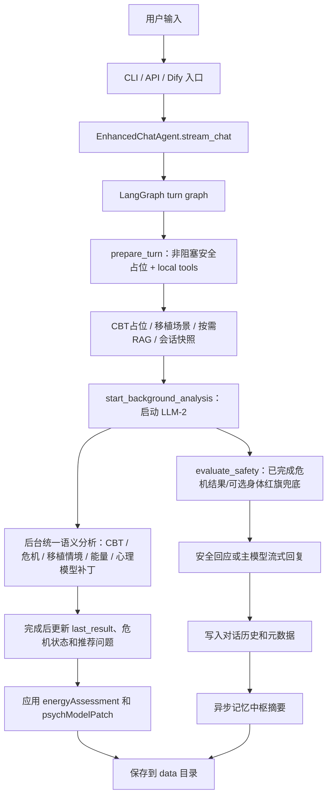

# 小芽 - 骨髓移植患者数字心理陪伴智能体

小芽是一个面向骨髓移植患者的中文心理支持智能体。当前项目同时提供命令行入口和 HTTP API 入口，核心能力包括：骨髓移植分期陪伴、CBT 认知行为疗法引导、心理能量评估、语义危机判断、对话记忆压缩和面向后端系统的流式接口。

> 说明：小芽提供心理陪伴和风险提示，不替代医生、护士、心理治疗师或紧急救援服务。真实业务接入时，危机报警必须连接院内人工处置流程。

## 当前能力

| 能力 | 当前实现 |
|---|---|
| 对话生成 | `EnhancedChatAgent.stream_chat()` 默认进入 LangGraph 编排层，模型优先流式输出，CLI 和 API 共用该核心流程 |
| 骨髓移植分期 | 支持移植前准备期、移植中关键期、移植后恢复期；默认流式路径把命中的场景话术作为主回复提示素材，非流式路径可能直接返回模板话术 |
| CBT 支持 | 默认流式主流程不使用本地关键词/规则触发 CBT；主回复模型按用户原话语义决定是否自然融入轻量 CBT，后台统一语义分析再补充结构化结果 |
| 危机判断 | 默认不阻塞首 token；主回复后由后台 LLM 结合用户长期心理模型做语义危机判断，本地身体红旗关键词仅作为可选兜底 |
| 心理能量 | 后台统一语义分析输出五个维度的成长评分，再由本地能量模型负责累计、等级和成就 |
| 记忆中枢 | 每轮后异步生成/更新摘要，下一轮只传系统提示、记忆摘要和当前问题 |
| API 会话隔离 | 每个 `sessionId` 独立持久化到 `data/sessions/<safe_session_id>` |
| 用户心理模型隔离 | API 可传 `userId` 或 `patientId`，每个用户独立持久化到 `data/users/<safe_user_id>`，同一用户跨会话继承心理状态，不同用户互不污染 |
| 会话运行时 | `xiaoya_agent/runtime/session.py` 统一管理 `sessionId -> threadId -> EnhancedChatAgent`，并提供列表、历史、重命名、自动命名和删除能力 |
| 本地工具层 | `xiaoya_agent/tools/local_tools.py` 注册 LangGraph 可调用的本地工具，不增加额外 LLM 调用 |
| MCP-style 服务层 | `xiaoya_agent/mcp_services/` 统一放置确定性服务；当前包含当前时间/日期服务，避免模型猜时间 |
| Dify 接入 | 提供 `/v1/dify/chat`、`/v1/dify/context`、`/v1/dify/grounding`、`/v1/dify/recommendations` 和 `docs/dify_openapi.yaml`，方便在 Dify Chatflow/Workflow 中作为自定义工具调用，内部仍走 LangGraph |
| 模型工具调用 | 非流式 `chat()` 路径可让模型按需调用本地工具，流式主路径仍不让模型工具调用阻塞首 token |
| RAG 检索 | 运行时只调用 Dify Knowledge Base；`File/` 仅作为项目参考资料，不参与 RAG，也不会作为失败兜底 |
| 输出格式 | CLI/API 共用 `xiaoya_agent/utils/formatting.py`，减少 Markdown 符号进入终端或客户端 |
| 提示词配置 | 支持 `PROMPT_PROFILE`、`OUTPUT_MODE`、API `promptConfig`、持久化热更新和版本对比 |

## 项目结构

```text
Xiaoya/
├─ Code/
│  ├─ main.py                  # 命令行入口
│  ├─ api_server.py            # Flask/SSE API 服务
│  ├─ xiaoya_agent/
│  │  ├─ core/agent.py         # Agent 核心：对话流、模型调用、记忆和持久化
│  │  ├─ graph/turn_graph.py   # LangGraph 编排节点
│  │  ├─ tools/local_tools.py  # 本地工具与模型 tool calling 适配
│  │  ├─ mcp_services/         # MCP-style 确定性服务注册表，如当前时间服务
│  │  ├─ integrations/dify.py  # Dify Chatflow/Knowledge Base 适配
│  │  ├─ retrieval/rag.py      # Dify Knowledge Base RAG 统一入口
│  │  ├─ llm/structured.py     # Pydantic 结构化模型输出
│  │  ├─ prompts/runtime.py    # 提示词 profile 与输出模式
│  │  ├─ runtime/session.py    # API 会话、thread_id、患者上下文
│  │  ├─ runtime/state_store.py # 会话级 Agent 状态快照
│  │  ├─ interfaces/cli.py     # CLI 实现
│  │  ├─ interfaces/api_server.py # Flask/SSE API 实现
│  │  ├─ features/cbt.py       # CBT 分析与引导
│  │  ├─ features/crisis.py    # 危机语义判断、关键词兜底和报警记录
│  │  ├─ features/energy.py    # 心理能量评估与成就系统
│  │  ├─ domain/transplant.py  # 骨髓移植分期与场景话术
│  │  ├─ keywords/library.py   # 关键词、场景标签、情绪标签
│  │  ├─ utils/formatting.py   # 共享输出清洗工具
│  │  └─ config.py             # 配置读取与默认值
│  └─ tests/
│     └─ test_agent.py         # 综合测试
├─ File/                       # 项目参考资料，不参与运行时 RAG
├─ docs/
│  └─ dify_openapi.yaml        # Dify 自定义工具 OpenAPI 描述
├─ data/                       # 运行数据，默认忽略提交
├─ config.env                  # 本地开发配置
├─ config.env.example          # 配置模板
├─ 小芽项目技术说明文档.docx     # 面向技术人员的完整说明文档
└─ requirements.txt
```

`Code/` 顶层现在只保留启动入口和测试目录；业务代码统一放入 `Code/xiaoya_agent/`。新增代码应优先按职责放入对应分层，而不是再放回 `Code/` 顶层。

## 快速开始

### 1. 安装依赖

```powershell
python -m venv .venv
.\.venv\Scripts\activate
pip install -r requirements.txt
```

### 2. 配置模型

复制配置模板并填写本地密钥：

```powershell
Copy-Item config.env.example config.env
```

最少需要配置：

```env
API_BASE_URL=https://api.deepseek.com
API_KEY=your_api_key_here
MODEL_NAME=deepseek-chat
DATA_DIR=data
```

开发阶段可以把真实 API key 写在 `config.env` 中。正式部署时建议改为部署平台的环境变量或密钥管理服务。

### 3. 启动命令行项目

```powershell
python Code\main.py
```

可用命令：

| 命令 | 作用 |
|---|---|
| `help` | 查看命令 |
| `phase` | 查看或设置移植分期 |
| `energy` | 查看心理能量报告 |
| `progress` | 查看综合进度报告 |
| `grounding` | 获取 5-4-3-2-1 正念落地练习 |
| `save` | 手动保存进度 |
| `load` | 加载历史数据 |
| `user` | 查看当前命令行用户和对应数据目录 |
| `user <id>` | 切换到指定用户，自动保存当前用户并加载目标用户心理模型 |
| `users` | 列出已有用户心理模型 |
| `user-history [id]` | 查看某个用户统一管理的 API/CLI 会话历史索引 |
| `delete-user <id>` | 删除用户心理模型、统一历史索引和关联 API/CLI 会话 |
| `psych-model` / `model` | 查看当前 CLI 用户的心理模型快照，包括记忆摘要、个性化画像、CBT 画像、能量和危机概览 |
| `reset` | 重置对话和进度数据 |
| `quit` / `exit` | 退出程序 |

### 4. 启动 API 服务

```powershell
python Code\api_server.py
```

健康检查：

```powershell
curl http://127.0.0.1:8001/health
```

PowerShell 手工调用带中文 JSON 请求体的接口时，优先把请求体写入 UTF-8 文件，再用 `--data-binary "@文件名"` 发送。不要把 Bash 中的 `\"` 写法直接复制到 PowerShell，也不要依赖 `--data-raw '{"key":"value"}'`，Windows PowerShell 调用 `curl.exe` 时可能会把 JSON 双引号剥掉。

```powershell
@'
{"sessionId":"manual-main-001","message":"我今天有点焦虑，担心移植会失败。","patientContext":{"stage":"PRETREATMENT","psychEnergy":45}}
'@ | Set-Content -Path request-chat.json -Encoding utf8

curl.exe -N -X POST http://127.0.0.1:8001/v1/psych/chat `
  -H "Content-Type: application/json; charset=utf-8" `
  --data-binary "@request-chat.json"
```

服务端也会兼容常见的 PowerShell 外层单引号、中文编码请求体和调试期被剥掉双引号的 JSON-like 请求体；真正的 JSON 格式错误会返回 `400 invalid_request`。

核心接口如下；完整路由清单以 `/v1/capabilities` 为准：

| 接口 | 方法 | 说明 |
|---|---|---|
| `/v1/psych/chat` | `POST` | 心理陪伴对话，返回 SSE 流 |
| `/v1/dify/chat` | `POST` | Dify 自定义工具入口，返回阻塞 JSON，内部复用 LangGraph 主流程 |
| `/v1/dify/openapi.yaml` | `GET` | 供 Dify 导入的 OpenAPI 工具描述，也可直接使用 `docs/dify_openapi.yaml` |
| `/v1/dify/status` | `GET` | 查看当前哪些功能已由 Dify 接管、哪些仍保留在 Python/LangGraph |
| `/v1/dify/options` | `GET` | 给 Dify 工作流读取可用阶段、提示词 profile、输出模式和扁平输出字段 |
| `/v1/dify/recommendations` | `POST` | 给 Dify 分支/展示节点使用的推荐问题，返回 `question1` 到 `question4` |
| `/v1/dify/context` | `POST` | 给 Dify 页面/变量节点读取当前会话、用户模型、能量和风险摘要 |
| `/v1/dify/grounding` | `POST` | 给 Dify 页面展示 5-4-3-2-1 正念接地练习 |
| `/v1/mcp/services` | `GET` | 查看当前可用的 MCP-style 确定性服务 |
| `/v1/mcp/invoke` | `GET/POST` | 直接调试 MCP-style 服务，例如当前时间服务 |
| `/v1/psych/recommendations` | `POST` | 根据阶段、能量和情绪生成推荐提问 |
| `/v1/psych/analyze` | `POST` | 对单条输入做结构化语义分析预览，不写入聊天历史 |
| `/v1/knowledge/search` | `GET/POST` | 直接调用 Dify RAG 检索，便于调试 Dify Knowledge Base 召回 |
| `/v1/sessions/<sessionId>/psych-model` | `GET` | 查看当前会话内存中的用户心理模型快照 |
| `/v1/users` | `GET` | 查看已有用户及其统一会话数量 |
| `/v1/users/<userId>/psych-model` | `GET` | 查看某个用户已经保存到磁盘的长期心理模型 |
| `/v1/users/<userId>/conversations` | `GET` | 查看某个用户统一管理的 API/CLI 会话历史索引 |
| `/v1/users/<userId>` | `DELETE` | 删除用户心理模型、统一历史索引和关联 API/CLI 会话 |
| `/v1/capabilities` | `GET` | 查看当前服务暴露的用户功能接口清单 |
| `/health` | `GET` | 服务健康检查 |

## Dify + LangGraph 接入方式

当前推荐架构是：Dify 负责外层 Chatflow/Workflow、变量收集、页面发布和运营配置；小芽后端负责核心智能体运行时。Dify 通过自定义工具调用 `POST /v1/dify/chat`，该接口会把 Dify 的 `conversation_id` 映射为小芽 `sessionId` 和 LangGraph `thread_id`，把 Dify 的 `user` 映射为小芽 `userId`，因此同一 Dify 用户可以跨多个会话共享长期心理模型。

导入 Dify 自定义工具时，可以使用本地文件 `docs/dify_openapi.yaml`，也可以在 API 启动后用下面地址：

```text
http://127.0.0.1:8001/v1/dify/openapi.yaml
```

如果 Dify 运行在 Docker 容器或远程服务器里，需要把 `docs/dify_openapi.yaml` 的 `servers.url` 改成 Dify 能访问到的小芽 API 地址，例如局域网 IP、内网域名或反向代理地址。

Dify 工作流中建议传入这些字段：

```json
{
  "query": "{{#sys.query#}}",
  "conversation_id": "{{#sys.conversation_id#}}",
  "user": "{{#sys.user_id#}}",
  "inputs": {
    "stage": "PRETREATMENT",
    "psychEnergy": 45
  }
}
```

`/v1/dify/chat` 返回普通 JSON，核心字段是 `answer`，可直接接到 Dify 的 Answer 节点；`metadata` 中会保留 `energyAssessment`、`crisisAssessment`、`recommendedQuestions`、`agentMeta` 和 `session`。默认 `waitForAnalysis=true`，接口会按 `POST_STREAM_ANALYSIS_WAIT_SECONDS` 等待后台结构化分析，保证返回给 Dify 的质量相关元数据尽量完整；如果只是做低延迟预览，可以在请求中显式传 `waitForAnalysis=false`。

为了让 Dify 替换更多前端展示和简单分支，`/v1/dify/chat` 还会返回扁平字段：

| 字段 | 用途 |
|---|---|
| `difyOutputs.answer` | 接 Dify Answer 节点 |
| `difyOutputs.nextAction` | Dify IF/ELSE 分支：`answer_only`、`show_recommended_questions`、`alert_and_notify`、`emergency_alert` |
| `difyOutputs.question1` 到 `question4` | Dify 页面直接展示推荐问题 |
| `difyOutputs.sessionTitle` | Dify 会话列表或卡片展示 |
| `difyOutputs.crisisLevel` / `shouldNotify` | Dify 外层流程决定是否展示报警组件 |
| `difyOutputs.retrievalBackend` / `knowledgeMatchCount` | Dify 调试知识库是否接管 RAG |

`/v1/dify/options` 用来告诉 Dify 当前可传入哪些变量，包括 `stage`、`psychEnergy`、`promptProfile`、`outputMode`、`responseStyle`、`workflowContext` 等。`responseStyle` 和 `workflowContext` 会被后端转成 `extraInstructions`，等于把简单风格选择和前置流程上下文交给 Dify 管。

`/v1/dify/context` 用来替代前端直接读多个后端接口的做法。Dify 只要传 `conversation_id` 和 `user`，就能拿到 `sessionTitle`、`messageCount`、`stage`、`preferredName`、`mainConcerns`、`supportPreferences`、`energyReport`、`crisisReport` 等紧凑上下文。`/v1/dify/grounding` 则把接地练习包装成 `difyOutputs.exercise`，适合在 Dify 的卡片或回答节点中展示。

可以由 Dify 替换的功能已经做成可配置项：

| 功能 | 默认实现 | Dify 替换方式 |
|---|---|---|
| 外层对话流程 | Python API / CLI 直接调用 LangGraph | Dify Chatflow 调 `/v1/dify/chat`，小芽只保留核心 LangGraph 智能体运行时 |
| 知识库检索 RAG | Python 只保留 Dify 检索入口 | Dify Knowledge Base 负责资料维护、切片和召回；`File/` 不作为 RAG 语料或兜底 |
| 提示词和变量编排 | 本地 `promptConfig`、提示词 registry、版本 diff | Dify Chatflow 可把 profile、outputMode、extraInstructions、stage、psychEnergy 作为工具输入传给 `/v1/dify/chat` |
| 推荐问题展示 | API 返回 `recommendedQuestions` 后由前端自行展示 | Dify 读取 `difyOutputs.question1` 到 `question4` 或调用 `/v1/dify/recommendations` |
| 简单流程分支 | 前端或业务代码读取危机/推荐字段判断 | Dify 读取 `difyOutputs.nextAction`、`shouldNotify`、`crisisLevel` 做 IF/ELSE |
| 会话展示信息 | 后端 `session_meta.json` 维护 title/messageCount | Dify 读取 `difyOutputs.sessionTitle`、`messageCount` 做外层展示 |
| 用户/会话上下文展示 | 前端分别查 session、psych-model、energy、crisis | Dify 调 `/v1/dify/context` 一次拿紧凑上下文 |
| 正念接地练习展示 | 前端调 `/v1/sessions/<id>/grounding` | Dify 调 `/v1/dify/grounding` 直接展示 `difyOutputs.exercise` |

暂时不建议由 Dify 替换的部分包括：危机分级与报警、用户长期心理模型、心理能量累计、会话状态持久化和 LangGraph 节点编排。这些部分与医疗安全、个性化和本地数据一致性强绑定，继续留在 Python/LangGraph 里更稳。

当前配置默认把 RAG 指向 Dify Knowledge Base；只要填入 Dify 知识库配置就会自动生效。查看状态：

```powershell
curl.exe http://127.0.0.1:8001/v1/dify/status
```

RAG 只使用 Dify Knowledge Base，在 `config.env` 中配置：

```env
RAG_BACKEND=dify
DIFY_API_BASE_URL=https://api.dify.ai/v1
DIFY_KNOWLEDGE_API_KEY=你的 Dify Knowledge API Key
DIFY_KNOWLEDGE_BASE_ID=你的知识库 Dataset ID
DIFY_KNOWLEDGE_FALLBACK_TO_LOCAL=false
DIFY_KNOWLEDGE_SEARCH_METHOD=keyword_search
```

启用后，`retrieve_knowledge()`、`/v1/knowledge/search`、LangGraph 本地工具 `knowledge_retrieval` 和主对话中的按需 RAG 都只使用 Dify Knowledge Base。若 Dify 配置缺失或调用失败，系统会直接返回 `dify_not_configured` 或 `dify_retrieval_failed`，不会读取 `File/` 兜底。

## Dify 操作流程

### 1. 启动并确认小芽 API 可用

```powershell
python Code\api_server.py
curl.exe http://127.0.0.1:8001/health
curl.exe http://127.0.0.1:8001/v1/capabilities
curl.exe http://127.0.0.1:8001/v1/dify/status
curl.exe http://127.0.0.1:8001/v1/dify/options
```

`/v1/capabilities` 用来确认当前暴露了 `chat`、`dify`、`rag`、`sessions`、`users`、`prompts` 这些接口分类；`/v1/dify/status` 用来确认 Dify Knowledge Base 是否已配置并启用；`/v1/dify/options` 用来给 Dify 工作流读取可选分期、提示词 profile、输出模式和扁平输出字段。

### 2. 在 Dify 中导入自定义工具

在 Dify 的工具/自定义工具中导入 `docs/dify_openapi.yaml`，或者填写 API 启动后的 OpenAPI 地址：

```text
http://127.0.0.1:8001/v1/dify/openapi.yaml
```

如果 Dify 不是运行在本机，需要把 `docs/dify_openapi.yaml` 里的 `servers.url` 改成 Dify 能访问到的小芽 API 地址，例如局域网 IP、内网域名或反向代理地址。导入后重点使用 `xiaoyaDifyChat`；其他工具如 `getXiaoyaDifyContext`、`getXiaoyaDifyGrounding`、`getXiaoyaDifyRecommendations` 可以放在页面展示或分支节点中。

### 3. 推荐的 Dify Chatflow 编排

建议 Dify 外层负责收集变量、页面展示和简单分支，小芽后端负责 LangGraph 智能体、危机分级、心理模型、能量、会话持久化和 RAG。工具节点调用 `xiaoyaDifyChat` 时可传：

```json
{
  "query": "{{#sys.query#}}",
  "conversation_id": "{{#sys.conversation_id#}}",
  "user": "{{#sys.user_id#}}",
  "inputs": {
    "stage": "{{#start.stage#}}",
    "psychEnergy": "{{#start.psychEnergy#}}",
    "promptProfile": "warm_cbt",
    "outputMode": "brief_support",
    "responseStyle": "{{#start.responseStyle#}}",
    "workflowContext": "{{#start.workflowContext#}}"
  }
}
```

Answer 节点优先展示 `answer`。IF/ELSE 节点可以读取 `difyOutputs.nextAction`、`difyOutputs.shouldNotify` 和 `difyOutputs.crisisLevel`：普通回复走 `answer_only`，推荐问题展示走 `show_recommended_questions`，高危提醒走 `alert_and_notify`，紧急危机走 `emergency_alert`。推荐问题展示读取 `difyOutputs.question1` 到 `difyOutputs.question4`；会话卡片读取 `difyOutputs.sessionTitle`。

### 4. 配置 Dify Knowledge Base RAG

在 Dify 中创建知识库并上传资料后，把 Dataset ID 和 Knowledge API Key 写入 `config.env`：

```env
RAG_BACKEND=dify
DIFY_API_BASE_URL=https://api.dify.ai/v1
DIFY_KNOWLEDGE_API_KEY=你的 Dify Knowledge API Key
DIFY_KNOWLEDGE_BASE_ID=你的知识库 Dataset ID
DIFY_KNOWLEDGE_FALLBACK_TO_LOCAL=false
DIFY_KNOWLEDGE_SEARCH_METHOD=keyword_search
```

重启 API 后检查：

```powershell
curl.exe http://127.0.0.1:8001/v1/dify/status
curl.exe -X POST http://127.0.0.1:8001/v1/knowledge/search `
  -H "Content-Type: application/json" `
  --data-binary "@request.json"
```

如果 `retrievalBackend` 为 `dify`，表示当前 RAG 正在调用 Dify Knowledge Base。若 Dify 配置缺失或调用失败，接口会返回 `dify_not_configured` 或 `dify_retrieval_failed`；`File/` 不会作为兜底资料源。

### 5. 常用调试入口

| 目标 | 接口 |
|---|---|
| 检查 Dify 替换状态 | `GET /v1/dify/status` |
| 读取 Dify 可用输入和输出字段 | `GET /v1/dify/options` |
| 模拟 Dify 主对话工具 | `POST /v1/dify/chat` |
| 单独生成推荐问题 | `POST /v1/dify/recommendations` |
| 读取紧凑会话/用户上下文 | `POST /v1/dify/context` |
| 读取正念接地练习 | `POST /v1/dify/grounding` |
| 调试知识召回 | `GET/POST /v1/knowledge/search` |

## 主流程



CLI 和 API 的关键一致性在于：两者都调用 `agent.stream_chat(message)`。当 `AGENT_GRAPH_ENABLED=true` 时，该入口会先进入 `Code/xiaoya_agent/graph/turn_graph.py` 中的 LangGraph 编排层；如关闭该配置，则回退到 `EnhancedChatAgent._stream_chat_legacy()`。API 会在 `done` 前按 `POST_STREAM_ANALYSIS_WAIT_SECONDS` 等待后台分析；CLI 默认不等待完整后台分析，避免能量评估和心理模型更新拖慢交互。

默认流式请求的处理顺序：

1. `prepare_turn` 节点读取当前移植分期，生成 CBT 占位分析 `semantic_background_pending`。默认 `CRISIS_LLM_STREAM_BLOCKING_ENABLED=false`，因此 `_assess_crisis_for_stream()` 不会在首 token 前等待危机 LLM，而是先返回 `semantic_background_pending`；随后调用本地工具生成身体红旗记录、移植场景和会话快照结果；普通情绪陪伴轮次会跳过 RAG，只有资料/知识/移植问题明显相关时才检索。
2. `start_background_analysis` 节点按 `BACKGROUND_ANALYSIS_START_MODE` 决定是否提前启动 LLM-2；默认 `after_stream`，即先保证主回复流式输出，回复结束后再启动后台能量评估和心理模型补丁，避免后台分析与主回复抢模型服务。
3. `evaluate_safety` 节点只处理已经完成的非阻塞危机结果或可选的本地医疗兜底；只有 `CRISIS_LLM_STREAM_BLOCKING_ENABLED=true` 时，才会在首 token 前等待轻量语义安全预检。只有 `MEDICAL_RED_FLAG_RULE_ENABLED=true` 时，才允许本地身体红旗关键词扫描作为院内保守兜底直接触发报警。默认不做 CBT 关键词/规则判断。
4. `apply_response_context` 节点同步必要的移植阶段，然后把状态交回 `stream_chat()`。
5. 默认主回复模型 LLM-1 直接流式输出，由实时提示词按用户原话语义决定是否融入轻量 CBT 或安全提醒；如果开启阻塞安全预检且预检确认危机，系统会先输出固定安全回应。
6. 回复结束后先写入历史、生成 `last_result`，并把本轮工具执行摘要写入 `tool_trace`，同时异步更新记忆中枢 LLM-3；此处不再同步做关键词心理能量评分或关键词心理模型提取。
7. 回复结束后启动后台语义分析；默认 `BACKGROUND_CRISIS_FIRST_ENABLED=true`，后台会先做一次危机语义判断，若发现危机就立即报警并结束本轮分析，不再继续能量评估或心理模型补丁；若未发现危机，再继续完整的 CBT、移植情境、`energyAssessment` 和 `psychModelPatch` 综合分析。

## 会话管理

API 会话运行时集中在 `Code/xiaoya_agent/runtime/session.py`：

| 对象/函数 | 作用 |
|---|---|
| `SessionManager` | 保存单个会话的 `session_id`、`user_id`、`thread_id`、`data_dir`、`psych_model_dir`、`agent`、锁和最后访问时间 |
| `get_or_create_session()` | 根据 `sessionId` 和可选 `userId` 获取或创建会话；会话目录映射到 `data/sessions/<safe_session_id>`，用户心理模型目录映射到 `data/users/<safe_user_id>` |
| `prepare_session_for_chat()` | 每轮对话前同步患者阶段、重建外部历史、应用 `promptConfig`，并把 `thread_id` 写入 agent |
| `update_session_after_chat()` | 每轮结束后更新 `session_meta.json`，记录标题、消息数、阶段和提示词版本 |
| `list_session_summaries()` | 扫描 `data/sessions/` 并返回会话列表 |
| `rename_session()` / `auto_name_session()` / `delete_session()` | 支持重命名、按首条用户消息自动命名和删除会话目录 |
| `sync_user_conversation_history()` | 把 API 或 CLI 会话快照写入 `data/users/<safe_user_id>/conversations/`，并更新用户级 `conversation_index.json` |
| `list_user_conversations()` / `delete_user()` | 查看某个用户的统一会话历史，或删除该用户及其关联会话 |
| `build_thread_id()` | 将外部 `sessionId` 规范化为 LangGraph 可用的稳定 `thread_id` |

当前仍保留 `EnhancedChatAgent` 的 JSON 持久化文件，包括 `chat_history.json`、`user_state.json`、`energy_progress.json` 和 `crisis_history.json`。每个 API 会话还会写入 `agent_state.json`，集中保存完整对话历史、记忆中枢、用户状态、提示词 profile/output mode 和最近工具轨迹；进程重启后会优先用它恢复 Agent。`agent_state.json` 在 `/v1/psych/chat` 的 `done` 事件返回前同步写入，并通过临时文件替换落盘，降低服务刚退出时丢最后一轮或留下半截 JSON 的风险。会话管理信息单独写入 `session_meta.json`，不污染聊天历史。`thread_id` 已经传入 LangGraph `graph.invoke(..., config={"configurable": {"thread_id": ...}})`，后续如果接入 LangGraph checkpointer 或 store，可以沿用这个标识，不需要改 API 入参。

用户心理模型与会话状态分开保存。API 请求可以在顶层传 `userId` / `patientId`，也可以放在 `patientContext.userId` / `patientContext.patientId`；如果不传，开发阶段默认用 `sessionId` 作为用户标识。系统会把用户模型写入 `data/users/<safe_user_id>/`，其中包括 `psych_model.json`、`user_state.json`、`energy_progress.json`、`crisis_history.json`、`conversation_index.json` 和 `conversations/`。同一个 `userId` 打开多个不同 `sessionId` 时，会共享长期记忆摘要、移植分期、CBT 用户画像、心理能量和危机历史；不同 `userId` 的目录完全隔离。`agent_state.json` 仍保留会话快照和兼容字段，但 API 恢复会话时不会再用旧会话快照覆盖用户心理模型。

用户的对话历史现在有一个统一管理入口：API 会话和 CLI 会话都会同步一份快照到 `data/users/<safe_user_id>/conversations/`，同时更新 `conversation_index.json`。`GET /v1/users/<userId>/conversations` 读取这个用户级索引；`DELETE /v1/users/<userId>` 会删除该用户的心理模型目录、统一历史索引、用户级会话快照，并清理该用户绑定的 API 会话目录和旧版 CLI 会话目录。

`psych_model.json` 中的 `personalization_profile` 会随每轮对话更新，记录用户称呼、近期主要关注、常见情绪、认知模式、偏好的回应方式、已尝试或可能有效的支持方式和风险提示。主回复模型生成前会收到一个简短的 `[用户心理模型]` 系统上下文，用它自然调整称呼、语气、支持方式和关注点；回复中不会直接暴露“心理模型/档案”这些内部说法。如果当前用户原话和旧模型冲突，当前原话优先。

查看心理模型时有两个入口：`GET /v1/sessions/<sessionId>/psych-model` 返回当前会话内存里的最新模型快照，适合调试一轮对话刚结束后的状态；`GET /v1/users/<userId>/psych-model` 读取 `data/users/<safe_user_id>/psych_model.json` 中已经落盘的长期模型，适合确认持久化结果。CLI 中可以输入 `psych-model` 或 `model` 查看当前切换用户的同一套模型字段。

同一个 `sessionId` 首次创建后会绑定到固定 `userId`。后续如果用另一个 `userId` 打开同一会话，系统会返回 `400 invalid_request`，避免一段会话历史被错误挂到另一个用户的心理模型上。

外部 `sessionId` 会规范化成 `safeSessionId` 作为目录名和内存会话键。若两个不同的 `sessionId` 会映射到同一个 `safeSessionId`，系统会拒绝创建或读取，避免不同会话共用同一个 `data/sessions/<safe_session_id>` 目录。

会话管理 API：

除 `/v1/psych/chat` 会按 `sessionId` 自动创建会话外，下面这些会话查询和操作接口要求会话已经存在；如果传错 `sessionId`，会返回 404，避免误创建空会话。

| 接口 | 作用 |
|---|---|
| `GET /v1/sessions` | 获取会话列表 |
| `POST /v1/sessions` | 创建会话元数据，可传 `sessionId`、`userId`/`patientId` 和 `title` |
| `GET /v1/sessions/<sessionId>` | 获取单个会话元数据 |
| `PATCH /v1/sessions/<sessionId>` | 重命名会话，body 传 `{"title": "..."}` |
| `DELETE /v1/sessions/<sessionId>` | 删除会话目录和内存会话 |
| `GET /v1/sessions/<sessionId>/history` | 获取会话历史，默认不返回 system 消息 |
| `POST /v1/sessions/<sessionId>/auto-name` | 根据首条用户消息或传入 `message` 自动命名 |
| `GET /v1/sessions/<sessionId>/state` | 查看当前会话运行态，包括 `userId`、`psychModelDir`、分期、提示词 profile、输出模式、消息数和最近工具轨迹 |
| `GET /v1/sessions/<sessionId>/psych-model` | 查看当前会话内存中的完整用户心理模型快照，包含 `memory_core`、`personalization_profile`、`cbt_user_profile`、`energy_report`、`crisis_report` |
| `PATCH /v1/sessions/<sessionId>/state` | 更新会话运行态，目前支持传 `phase` 或 `stage` 修改移植分期 |
| `GET /v1/sessions/<sessionId>/phase` | 查看当前移植分期，可返回中文 `phase` 和英文 `stage` |
| `PATCH /v1/sessions/<sessionId>/phase` | 设置当前移植分期，支持 `PRETREATMENT`、`TRANSPLANT`、`RECOVERY` 或中文分期 |
| `GET /v1/sessions/<sessionId>/energy` | 获取心理能量报告 |
| `GET /v1/sessions/<sessionId>/achievements` | 获取成就统计和按类别分组的成就列表 |
| `GET /v1/sessions/<sessionId>/progress` | 获取综合进度报告，包括 CBT、能量、危机历史和会话数 |
| `GET /v1/sessions/<sessionId>/crisis-report` | 获取危机历史统计 |
| `GET /v1/sessions/<sessionId>/grounding` | 获取 5-4-3-2-1 正念接地练习文本，不记录练习 |
| `POST /v1/sessions/<sessionId>/grounding` | 获取并记录一次正念接地练习，可带 `{"record": true}` |
| `POST /v1/sessions/<sessionId>/save` | 手动保存当前会话历史、用户状态、能量、危机记录和 `agent_state.json` |
| `POST /v1/sessions/<sessionId>/reset` | 重置该会话的对话、用户状态、能量进度、危机历史和状态快照 |
| `GET /v1/users` | 查看已有用户、用户目录和统一会话数量 |
| `GET /v1/users/<userId>/psych-model` | 查看某个用户已经保存的长期心理模型，不要求当前进程中已有对应会话 |
| `GET /v1/users/<userId>/conversations` | 查看某个用户统一管理的 API/CLI 会话索引；加 `?includeHistory=true` 可返回快照历史 |
| `GET /v1/users/<userId>/history` | `conversations` 的别名 |
| `DELETE /v1/users/<userId>` | 删除用户心理模型、统一历史索引和关联 API/CLI 会话 |

注意：`DELETE /v1/sessions/<sessionId>` 只删除单个会话目录和该会话在用户统一索引中的快照，不删除 `data/users/<safe_user_id>/` 下的用户心理模型。`DELETE /v1/users/<userId>` 是用户级删除，会清掉用户目录和关联会话。`POST /v1/sessions/<sessionId>/reset` 会通过当前会话对应的 agent 重置该用户的心理模型数据，适合测试或明确需要清空该用户状态时使用。

## 工具层

本地工具集中在 `Code/xiaoya_agent/tools/local_tools.py`，默认由主回复模型按 tool schema 自主决定是否调用。移植场景、会话快照和身体红旗扫描是确定性工具，不会调用 LLM；`knowledge_retrieval` 只调用 Dify Knowledge Base，不读取 `File/`。危机语义预检是独立的安全模型调用，由 `CRISIS_LLM_STREAM_BLOCKING_ENABLED` 控制。

MCP-style 服务统一放在 `Code/xiaoya_agent/mcp_services/`。当前已有 `current_time` 服务；用户询问“现在几点”“今天几号”“星期几”等实时事实时，模型应调用 `mcp_service_router`，系统执行确定性时间服务后把结构化结果作为 tool message 交回模型，再由模型结合用户完整问题生成最终回复。

| 工具 | 作用 | 是否调用大模型 |
|---|---|---|
| `mcp_service_router` | 调用统一 MCP-style 服务层，当前支持当前时间、日期和星期 | 否 |
| `medical_red_flag_scan` | 记录移植病房身体红旗词命中情况；默认只写入工具摘要，打开 `MEDICAL_RED_FLAG_RULE_ENABLED=true` 后可作为院内保守兜底直接提醒医护 | 否 |
| `transplant_context_lookup` | 根据文本、当前分期和情绪强度查找移植阶段、场景与模板素材 | 否 |
| `knowledge_retrieval` | 从 Dify Knowledge Base 检索相关片段；`File/` 不作为 RAG 来源 | 会调用 Dify API |
| `conversation_state_snapshot` | 记录本轮可观测的会话状态，如分期、历史长度、是否有记忆摘要 | 否 |

`AGENT_TOOLS_ENABLED=true` 且 `AGENT_MODEL_TOOL_CALLING_ENABLED=true` 时，`python Code\main.py` 和 `/v1/psych/chat` 的默认流式主流程会把工具 schema 交给模型，由模型决定是否调用 `mcp_service_router`、`knowledge_retrieval`、`transplant_context_lookup`、`medical_red_flag_scan` 或 `conversation_state_snapshot`。

如果关闭 `AGENT_MODEL_TOOL_CALLING_ENABLED`，LangGraph 会退回到旧的本地预调用路径：系统先用轻量条件判断调用必要工具，再把工具上下文注入主回复提示词。这条路径只作为兼容兜底保留。

每轮工具执行都会生成一个短摘要，字段名是 `tool_trace`。流式主路径的来源是 `langgraph_prepare_turn`，非流式模型 tool calling 的来源是 `model_tool_calling`。摘要只记录工具名、命中数量、RAG 来源、移植场景是否触发等调试信息，不把完整资料片段或长提示词塞进 API 元数据。

## 危机判断策略

当前代码对“心理/安全危机”采用语义判断，并把用户长期心理模型摘要作为风险校准参考；默认流式路径不在首 token 前等待危机 LLM，不再让关键词规则直接触发心理危机报警：

| 场景 | 当前策略 |
|---|---|
| 普通流式对话 | 主回复不等待危机 LLM；回复后后台综合分析补充结构化危机结果 |
| 用户心理模型 | 后台语义危机判断会读取 `memory_core`、`risk_notes`、近期关注和常见情绪作为参考，但当前原话优先 |
| 后台分析完成较快 | API `done` 事件中会合并最新语义危机结果 |
| 后台分析较慢 | 先完成回复，语义结果在 `last_result` 中后置更新 |
| 身体红旗 | 默认由后台语义危机判断确认；可选打开本地医疗关键词兜底 |
| 非流式语义判断 | `assess_crisis_semantic_only()` 只走 LLM，不回退关键词 |
| 传统兜底方法 | `assess_crisis()` 仍保留 LLM 失败后的关键词兜底，但不是默认流式心理危机入口 |

危机报警现在统一分级，核心字段会出现在 `crisis_detection` 和 API `crisisAssessment.alarm` 中：

| crisisLevel | 含义 | 是否报警 | 处置动作 |
|---|---|---|---|
| `none` | 未达到危机提醒条件 | 否 | `none` |
| `watch` | 情绪压力偏高或有轻微信号，适合观察和温和引导 | 否 | `mindfulness_guide` |
| `warning` | 一级预警，需要尽快确认安全和支持资源 | 是 | `notify_support` |
| `high` | 二级高危报警，需要立即联系现场支持 | 是 | `alert_and_notify` |
| `critical` | 三级紧急报警或身体红旗，需要立即进入医护/紧急处置流程 | 是 | `emergency_intervention` 或 `contact_medical_staff` |

语义危机分数默认按 0-20 解释：`10-12` 为 `warning`，`13-15` 为 `high`，`16-20` 为 `critical`；自杀/自伤类型即使分数刚过阈值，也至少提升到 `high`。身体红旗始终按 `critical` 处理。

与速度相关的关键配置：

```env
CRISIS_LLM_DETECTION_ENABLED=true
CRISIS_LLM_STREAM_BLOCKING_ENABLED=false
CRISIS_PRECHECK_MAX_TOKENS=96
CRISIS_PRECHECK_TIMEOUT_SECONDS=1.8
MEDICAL_RED_FLAG_RULE_ENABLED=false
BACKGROUND_ANALYSIS_START_MODE=after_stream
BACKGROUND_CRISIS_FIRST_ENABLED=true
POST_STREAM_ANALYSIS_WAIT_SECONDS=8
RAG_AUTO_TRIGGER_ENABLED=true
```

默认把安全危机结构化判断放到主回复之后，主回复不等待危机 LLM，因此首 token 更快。`BACKGROUND_CRISIS_FIRST_ENABLED=true` 表示后台分析先做危机判断；一旦发现危机就报警并停止后续综合分析。`CRISIS_PRECHECK_*` 只在 `CRISIS_LLM_STREAM_BLOCKING_ENABLED=true` 时生效：它是首 token 前的轻量语义安全预检专用配置，仍然使用大模型语义判断，但提示词更短、输出更少，并由 `CRISIS_PRECHECK_TIMEOUT_SECONDS` 控制最长等待。`MEDICAL_RED_FLAG_RULE_ENABLED=false` 表示本地医疗关键词扫描只做工具记录，不直接触发报警；如需要极端保守的院内兜底，可改为 `true`。

## CBT 判断策略

默认 CLI 和 API 流式链路不再在首 token 前做“CBT 关键词/规则分析”，因此不会因为“总是、从来、不怕死”这类词被规则误判后强行插入 CBT 指令。主回复模型会在同一次回复生成里直接理解用户原话：如果用户表达焦虑、低落、绝望、愧疚、愤怒、灾难化或全或无思维，就自然融入一个很小的 CBT 方向引导；如果只是闲聊或事实问题，则正常回答。

后台统一语义分析仍会并行输出情绪、认知扭曲、困扰程度、推荐技术和危机分数，用于 `last_result`、API 元数据、推荐问题和后续轮次。`xiaoya_agent/features/cbt.py` 中的规则分析函数仍保留为独立模块/测试/手动降级能力，但不是 `python Code\main.py` 和 `/v1/psych/chat` 默认流式主回复的触发依据。

## 心理能量与心理模型更新

默认 CLI/API 聊天链路不再用本地关键词判断心理能量，也不再用“我叫/担心/害怕”等正则或关键词直接更新用户心理模型。当前做法是：

| 项目 | 当前策略 |
|---|---|
| 心理能量 | 后台 LLM-2 在 `energy_assessment` 中输出认知成长、情绪调节、行为改变、社交连接、自我效能五个维度分数和简短说明 |
| 能量累计 | `PsychologicalEnergyModel.apply_llm_assessment()` 只负责裁剪分数、应用连续性倍数、更新等级/成就和保存进度 |
| 心理模型 | 后台 LLM-2 在 `psych_model_patch` 中输出称呼、近期关注、认知模式、有效策略、支持偏好、风险提示和证据短句 |
| 模型合并 | `EnhancedChatAgent._apply_psych_model_patch()` 只做字段长度限制、去重、合并和保存，不再从用户原话做关键词提取 |
| CLI 体验 | CLI 不再为了显示心理能量反馈而等待完整后台分析；能量更新完成后可通过 `energy` 或 `psych-model` 查看 |

旧的 `assess_conversation_quality()` 和 CBT 规则分析仍保留为兼容/测试/手动降级能力，但默认 `/v1/psych/chat` 和 `python Code\main.py` 的聊天主流程不调用它们。

## 提示词与输出模式配置

提示词运行时配置集中在 `Code/xiaoya_agent/prompts/runtime.py`。默认从 `config.env` 读取：

```env
PROMPT_PROFILE=warm_cbt
OUTPUT_MODE=brief_support
```

当前内置 `PROMPT_PROFILE`：

| profile | 用途 |
|---|---|
| `warm_cbt` | 默认温暖 CBT 陪伴风格，不额外叠加系统提示 |
| `transplant_companion` | 更强调骨髓移植患者的病房处境、隔离感和治疗不确定性 |
| `clinical_plain` | 更克制、清晰、偏临床沟通风格 |

当前内置 `OUTPUT_MODE`：

| mode | 用途 |
|---|---|
| `brief_support` | 默认短回复陪伴模式 |
| `cbt_exercise` | 更倾向输出一个很小的 CBT 练习 |
| `transplant_support` | 更倾向结合移植阶段和病房体验 |
| `safety_first` | 更强调安全优先和联系现场支持 |

API 可按会话传入 `promptConfig` 覆盖配置：

```json
{
  "sessionId": "session-001",
  "message": "我现在很害怕",
  "promptConfig": {
    "promptProfile": "clinical_plain",
    "outputMode": "cbt_exercise",
    "extraInstructions": "回复更短一点，避免反问太多。"
  }
}
```

`promptConfig.systemPrompt` 也可以直接覆盖本会话的主系统提示词。接口会在 SSE `start` 和最终 `agentMeta` 中返回实际使用的 `promptProfile` 与 `outputMode`。

提示词也可以通过 API 持久化更新。更新内容写入 `data/prompt_registry.json`，每次 `resolve_prompt_runtime_config()` 都会检查文件修改时间；文件变化后下一轮对话自动使用新版本，不需要重启 API 服务。每次更新都会递增版本号并写入历史记录，历史记录包含 `changeNote`、`metadata` 和 `diffFromPrevious`。候选提示词可以先走 preview 接口，不写入 registry，用同一条测试输入分别生成当前版和候选版输出；人工确认后再调用 PUT 保存为新版本。

| 接口 | 作用 |
|---|---|
| `GET /v1/prompts` | 查看当前 profile、output mode、版本和历史 |
| `GET /v1/prompts?includeHistory=false` | 只看当前配置，不返回历史 |
| `PATCH /v1/prompts/settings` | 热切默认 `defaultProfile` 和 `defaultOutputMode` |
| `GET /v1/prompts/profiles/<profile>` | 查看单个 profile |
| `PUT /v1/prompts/profiles/<profile>` | 更新或新增 profile 后缀提示词，body 传 `content`，可选 `changeNote`、`metadata` |
| `POST /v1/prompts/profiles/<profile>/preview` | 预览候选 profile，不保存；可返回当前版/候选版 prompt 和模型输出对比 |
| `POST /v1/prompts/profiles/<profile>/rollback` | 回滚到指定历史版本，body 传 `version` |
| `DELETE /v1/prompts/profiles/<profile>` | 删除自定义 profile；内置 profile 会重置为内置默认值；加 `?purgeHistory=true` 可同时清空自定义历史 |
| `GET /v1/prompts/output-modes/<mode>` | 查看单个输出模式 |
| `PUT /v1/prompts/output-modes/<mode>` | 更新或新增输出模式实时要求，body 传 `content`，可选 `changeNote`、`metadata` |
| `POST /v1/prompts/output-modes/<mode>/preview` | 预览候选输出模式，不保存；可返回当前版/候选版 prompt 和模型输出对比 |
| `POST /v1/prompts/output-modes/<mode>/rollback` | 回滚到指定历史版本，body 传 `version` |
| `DELETE /v1/prompts/output-modes/<mode>` | 删除自定义输出模式；内置输出模式会重置为内置默认值；加 `?purgeHistory=true` 可同时清空自定义历史 |
| `GET /v1/prompts/compare?kind=profile&key=warm_cbt` | 默认比较当前版本和上一版本 |
| `POST /v1/prompts/preview` | 通用候选提示词预览接口，body 传 `kind`、`key`、`candidateContent` |
| `POST /v1/prompts/reload` | 清空内存缓存并重新读取 `prompt_registry.json` |

示例：

```json
{
  "content": "回复更克制、短句更多，优先给一个可执行的小步骤。",
  "description": "临床简洁风格 v2",
  "changeNote": "减少长段安慰，强化可执行下一步",
  "metadata": {"operator": "dev"}
}
```

候选输出预览示例：

```json
{
  "candidateContent": "回复更短，先共情，再只给一个具体小步骤。",
  "message": "我今天很焦虑，怕移植失败。",
  "generate": true,
  "maxTokens": 180
}
```

该请求不会保存候选版本；返回结果中 `current.reply` 和 `candidate.reply` 用于人工对比，确认后再调用对应 `PUT` 接口保存。`generate=true` 时 current/candidate 两个模型输出会并发生成，接口等待时间接近较慢的一次调用，而不是两次调用耗时相加。

## API 调用示例

`/v1/psych/chat` 返回 `text/event-stream`，事件包括 `start`、多个 `delta`、最终 `done`，异常时返回 `error`。

```json
{
  "sessionId": "session-001",
  "patientContext": {
    "patientId": "p-001",
    "stage": "PRETREATMENT",
    "psychEnergy": 55
  },
  "history": [
    {"role": "user", "content": "昨天很难受"},
    {"role": "assistant", "content": "我听见你昨天真的很辛苦。"}
  ],
  "message": "今天感觉好一点了，但还是有点害怕"
}
```

最终 `done` 数据结构：

```json
{
  "reply": "模型最终回复文本",
  "energyAssessment": {
    "cognitiveGrowth": 0,
    "emotionRegulation": 0,
    "behaviorChange": 0,
    "socialConnection": 0,
    "selfEfficacy": 0,
    "totalDelta": 0,
    "hopeTreeExpDelta": 0,
    "assessmentNote": "本轮对话获得 0 点心理能量"
  },
  "crisisAssessment": {
    "crisisAlert": false,
    "crisisLevel": "none",
    "severityScore": 0,
    "alarm": {
      "level": "none",
      "label": "无危机",
      "title": "无危机报警",
      "action": "none",
      "shouldNotify": false,
      "requiresImmediateAction": false
    },
    "crisisKeywords": [],
    "emotionSignals": [],
    "action": "none",
    "mindfulnessGuide": null
  },
  "recommendedQuestions": [],
  "agentMeta": {
    "model": "deepseek-chat",
    "tokensUsed": 0,
    "latencyMs": 1200,
    "firstDeltaMs": 300,
    "streamMode": "model_first_background_analysis",
    "analysisStatus": "completed",
    "analysisWaitMs": 120,
    "toolTrace": {
      "source": "langgraph_prepare_turn",
      "toolCount": 4,
      "tools": [
        {
          "name": "knowledge_retrieval",
          "matchCount": 1,
          "hasContext": true,
          "retrievalBackend": "dify",
          "scoringMode": "keyword_search",
          "fallbackUsed": false
        }
      ]
    },
    "sessionId": "session-001",
    "userId": "patient-001",
    "threadId": "session-001",
    "psychModelDir": "data/users/patient-001",
    "psychModel": {
      "memoryCore": "用户近期主要担心移植失败和排异风险。",
      "personalizationProfile": {
        "preferred_name": "小王",
        "current_main_concerns": ["担心排异"],
        "communication_style": "brief"
      }
    },
    "stage": "PRETREATMENT",
    "promptProfile": "warm_cbt",
    "outputMode": "brief_support",
    "promptProfileVersion": 1,
    "outputModeVersion": 1
  },
  "session": {
    "sessionId": "session-001",
    "userId": "patient-001",
    "title": "今天感觉好一点了",
    "messageCount": 1,
    "updatedAt": "2026-05-12T12:00:00"
  }
}
```

## 主要配置

| 配置项 | 默认值 | 说明 |
|---|---:|---|
| `API_BASE_URL` | `https://api.deepseek.com` | OpenAI 兼容接口地址 |
| `API_KEY` | 空 | 模型调用密钥，运行前必须填写 |
| `MODEL_NAME` | `deepseek-chat` | 主回复模型 |
| `DATA_DIR` | `data` | 持久化数据目录，相对路径会按项目根目录解析 |
| `TEMPERATURE` | `0.7` | 主回复随机性 |
| `MAX_TOKENS` | `1000` | 主回复最大 token |
| `AGENT_GRAPH_ENABLED` | `true` | 是否启用 LangGraph 编排层；关闭后回退到旧版 `_stream_chat_legacy()` 流程 |
| `AGENT_TOOLS_ENABLED` | `true` | 是否在 LangGraph `prepare_turn` 节点启用本地工具层 |
| `AGENT_MODEL_TOOL_CALLING_ENABLED` | `true` | 是否在非流式普通回复路径启用模型 tool calling |
| `AGENT_MODEL_TOOL_CALL_MAX_CALLS` | `2` | 单轮最多执行几个模型请求的本地工具 |
| `BACKGROUND_ANALYSIS_START_MODE` | `after_stream` | 后台语义分析启动时机；默认回复结束后启动，避免后台能量/心理模型分析拖慢主回复 |
| `BACKGROUND_CRISIS_FIRST_ENABLED` | `true` | 后台分析是否先做危机判断；发现危机后立即报警并跳过后续能量/心理模型综合分析 |
| `BACKGROUND_ANALYSIS_TIMEOUT_SECONDS` | `8` | 后台语义分析线程自身的最长等待时间 |
| `RESPONSE_MAX_TOKENS_NORMAL` | `240` | 普通流式主回复最大 token |
| `RESPONSE_MAX_TOKENS_CBT` | `280` | 需要 CBT 微引导时的流式主回复最大 token |
| `PROMPT_PROFILE` | `warm_cbt` | 默认提示词 profile，见 `Code/xiaoya_agent/prompts/runtime.py` |
| `OUTPUT_MODE` | `brief_support` | 默认输出模式，见 `Code/xiaoya_agent/prompts/runtime.py` |
| `MCP_SERVICES_ENABLED` | `true` | 是否启用统一 MCP-style 服务层 |
| `MCP_TIMEZONE` | `Asia/Shanghai` | 当前时间服务使用的时区 |
| `RAG_ENABLED` | `true` | 是否启用 RAG 检索工具；运行时后端固定为 Dify Knowledge Base |
| `RAG_SOURCE_DIR` | `File` | 兼容旧配置保留；运行时不会读取该目录作为 RAG |
| `RAG_TOP_K` | `3` | 每轮最多注入的检索片段数 |
| `RAG_CHUNK_SIZE` | `450` | 兼容旧配置保留；Dify 侧负责切片 |
| `RAG_MAX_CONTEXT_CHARS` | `900` | 注入主回复提示词的资料上下文最大字符数 |
| `RAG_MIN_SCORE` | `0.08` | 兼容旧配置保留；Dify 检索不使用本地阈值 |
| `RAG_SCORING_MODE` | `tfidf` | 兼容旧配置保留；运行时以 `DIFY_KNOWLEDGE_SEARCH_METHOD` 为准 |
| `RAG_AUTO_TRIGGER_ENABLED` | `true` | 普通情绪陪伴轮次跳过 RAG，只在资料/知识/移植问题明显相关时检索 |
| `RAG_WARMUP_ON_START` | `true` | 兼容旧配置保留；启动时不会预热本地索引 |
| `RAG_BACKEND` | `dify` | RAG 后端应为 `dify`；关闭 Dify 时检索会返回 `dify_disabled` |
| `RAG_EMBEDDING_MODEL` | 空 | 兼容旧配置保留；embedding 模型应在 Dify 知识库侧配置 |
| `RAG_EMBEDDING_BASE_URL` | 同 `API_BASE_URL` | 兼容旧配置保留；运行时不调用本地 embedding |
| `RAG_EMBEDDING_API_KEY` | 同 `API_KEY` | 兼容旧配置保留；运行时不调用本地 embedding |
| `RAG_EMBEDDING_BATCH_SIZE` | `16` | 兼容旧配置保留 |
| `RAG_SEMANTIC_WEIGHT` | `0.72` | 兼容旧配置保留 |
| `DIFY_API_BASE_URL` | `https://api.dify.ai/v1` | Dify API 基础地址；私有化部署时改为自己的 Dify 地址 |
| `DIFY_API_KEY` | 空 | 通用 Dify API Key；未单独填写 `DIFY_KNOWLEDGE_API_KEY` 时可作为知识库检索密钥兜底 |
| `DIFY_KNOWLEDGE_API_KEY` | 空 | Dify Knowledge Base API Key；为空时不能启用 Dify RAG |
| `DIFY_KNOWLEDGE_BASE_ID` | 空 | Dify 知识库 Dataset ID |
| `DIFY_KNOWLEDGE_ENABLED` | `true` | 是否允许使用 Dify Knowledge Base；未填写 Dify key 时返回明确错误，不走本地兜底 |
| `DIFY_KNOWLEDGE_FALLBACK_TO_LOCAL` | `false` | 兼容旧配置字段；当前固定不回退到本地 |
| `DIFY_KNOWLEDGE_TIMEOUT_SECONDS` | `8` | Dify 知识库检索超时时间 |
| `DIFY_KNOWLEDGE_SEARCH_METHOD` | `keyword_search` | 传给 Dify 的检索方式；可设为 `auto`、`keyword_search`、`semantic_search` 或 `hybrid_search`，遇到 400 会尝试 `keyword_search` |
| `STRUCTURED_OUTPUT_ENABLED` | `true` | CBT/危机/移植/综合分析是否启用结构化输出请求和 Pydantic 校验 |
| `STRUCTURED_OUTPUT_MODE` | `json_object` | 结构化输出请求模式；供应商支持 JSON Schema 时可改为 `json_schema` |
| `STRUCTURED_OUTPUT_STRICT` | `false` | `json_schema` 模式下是否请求严格 schema |
| `SESSION_STATE_ENABLED` | `true` | API 会话是否写入并恢复 `agent_state.json` 状态快照 |
| `CBT_ENABLED` | `true` | 是否启用 CBT 能力 |
| `AUTO_CBT_INTERVENTION` | `true` | 是否允许已有结构化 CBT 分析的路径合入 CBT 微引导；默认流式主回复由实时提示词做语义自决策 |
| `CBT_LLM_ENABLED` | `true` | 后台统一分析/独立 CBT 分析是否优先使用 LLM |
| `CBT_INTERVENTION_SEVERITY_THRESHOLD` | `6` | 非流式或已有结构化分析路径中，情绪强度达到该值时追加 CBT 引导；默认流式首轮不靠该规则触发 |
| `CBT_DISTORTION_TRIGGER_ENABLED` | `true` | 非流式或已有结构化分析路径中，有认知扭曲时是否允许触发 CBT 引导；默认流式首轮不靠该规则触发 |
| `CRISIS_DETECTION_ENABLED` | `true` | 是否启用危机判断 |
| `CRISIS_ALERT_THRESHOLD` | `10` | 语义危机分数达到该阈值才报警；默认分级为 `10-12 warning`、`13-15 high`、`16-20 critical` |
| `CRISIS_LLM_DETECTION_ENABLED` | `true` | 是否启用危机 LLM 语义判断 |
| `CRISIS_LLM_STREAM_BLOCKING_ENABLED` | `false` | 是否在流式回复前等待语义安全预检；默认关闭，危机结构化判断在主回复后由后台综合分析补充 |
| `MEDICAL_RED_FLAG_RULE_ENABLED` | `false` | 是否允许本地身体红旗关键词扫描直接触发医疗安全报警；默认关闭，身体红旗由后台语义分析确认 |
| `TRANSPLANT_SUPPORT_ENABLED` | `true` | 是否启用移植分期支持 |
| `TRANSPLANT_LLM_SCENARIO_ENABLED` | `true` | 情境识别是否优先使用 LLM |
| `LLM_DETECTION_MODEL` | `deepseek-chat` | 后台综合分析、独立 CBT/危机/移植判断使用的模型 |
| `LLM_DETECTION_TEMPERATURE` | `0.4` | 结构化判断类调用的温度 |
| `LLM_DETECTION_MAX_TOKENS` | `256` | 独立结构化判断类调用的最大 token；后台综合分析会至少使用 900 token 以容纳能量和心理模型补丁 |
| `CRISIS_PRECHECK_MODEL` | `deepseek-chat` | 开启阻塞安全预检时使用的模型，可单独换成更快的兼容模型 |
| `CRISIS_PRECHECK_TEMPERATURE` | `0.0` | 阻塞安全预检温度，默认更稳定 |
| `CRISIS_PRECHECK_MAX_TOKENS` | `96` | 阻塞安全预检最大输出 token，避免普通输入被完整危机分析拖慢 |
| `CRISIS_PRECHECK_TIMEOUT_SECONDS` | `1.8` | 阻塞安全预检最长等待时间；超时后不回退关键词，主回复模型继续按安全提示生成 |
| `ENERGY_MODEL_ENABLED` | `true` | 是否启用能量模型持久化；聊天主流程的能量评分来自后台 LLM 结构化结果 |
| `ENERGY_FEEDBACK_ENABLED` | `true` | CLI 是否展示已完成的能量反馈；CLI 不再为了等待能量反馈阻塞下一次输入 |
| `AUTO_SAVE_PROGRESS` | `true` | CLI/API 是否在对话后自动保存历史、状态、能量和危机记录 |
| `HISTORY_COMPRESSION_ENABLED` | `true` | 是否启用记忆中枢摘要 |
| `INCREMENTAL_SUMMARY_MAX_WORDS` | `300` | 记忆摘要最大字数 |
| `POST_STREAM_ANALYSIS_WAIT_SECONDS` | `8` | API 输出 `done` 前等待后台语义结果的最长时间，保证 `crisisAssessment`、`recommendedQuestions` 等分析类字段尽量完整 |

## 提示词与用途

| 位置 | 提示词/模板 | 用途 |
|---|---|---|
| `Config.SYSTEM_PROMPT` | 主对话系统提示 | 运行时优先读取 `config.env` 中的 `SYSTEM_PROMPT`；当前开发配置为通用 CBT 心理健康助手提示，若删除该配置才使用 `Code/xiaoya_agent/config.py` 中的小芽/骨髓移植患者陪伴默认提示 |
| `xiaoya_agent.prompts.runtime.resolve_prompt_runtime_config()` | 提示词运行时配置 | 根据 `PROMPT_PROFILE`、`OUTPUT_MODE` 和 API `promptConfig` 生成本轮系统提示词与实时回复要求 |
| `xiaoya_agent.core.agent._create_response_stream()` | 实时回复要求提示词 | 控制流式主回复的长度、语气、安全边界，并要求模型直接按用户原话语义决定是否融入轻量 CBT，不依赖本地关键词标签 |
| `xiaoya_agent.core.agent._llm_unified_analyze()` | 综合分析助手提示词 | 一次 LLM 调用同时输出 CBT 分析、危机语义分数、移植情境识别、心理能量评估和用户心理模型补丁 |
| `xiaoya_agent.features.crisis._llm_detect_crisis()` | 危机评估助手提示词 | 结合用户原话、上下文和用户心理模型，判断心理危机/身体红旗、危机类型、严重分和原因 |
| `xiaoya_agent.features.cbt._llm_analyze_user_input()` | CBT 分析助手提示词 | 提取主要情绪、认知扭曲、问题严重度和推荐 CBT 技术 |
| `xiaoya_agent.features.cbt._llm_generate_cbt_guidance()` | CBT 引导生成提示词 | 根据用户原话和 CBT 分析，生成 50-150 字口语化引导 |
| `xiaoya_agent.features.cbt.technique_prompts` | CBT 技术模板 | 模型不可用或无需生成时的本地模板，包括认知重构、行为激活、问题解决、放松训练、正念、思维记录 |
| `xiaoya_agent.domain.transplant._llm_choose_intervention()` | 移植情境分期助手提示词 | 判断当前分期、是否触发预设引导、触发哪个场景 |
| `xiaoya_agent.domain.transplant.TEMPLATES` | 分期心理引导语库 | 直接输出或拼接到上下文的移植场景陪伴话术 |
| `xiaoya_agent.core.agent._update_memory_core()` | 记忆中枢管理器提示词 | 将本轮对话和分析结果融合进长期摘要 |
| `xiaoya_agent.interfaces.api_server.generate_recommended_questions()` | 推荐问题规则模板 | 根据情绪、危机、心理能量和移植阶段生成后端推荐提问 |

## 数据持久化

默认数据目录为项目根目录下的 `data/`：

```text
data/
├─ prompt_registry.json
├─ chat_history.json
├─ user_state.json
├─ energy_progress.json
├─ crisis_history.json
├─ users/
│  └─ <safe_user_id>/
│     ├─ psych_model_meta.json
│     ├─ psych_model.json
│     ├─ conversation_index.json
│     ├─ conversations/
│     │  ├─ api_<safe_session_id>.json
│     │  └─ cli_cli.json
│     ├─ cli_session/
│     │  └─ chat_history.json
│     ├─ user_state.json
│     ├─ energy_progress.json
│     └─ crisis_history.json
└─ sessions/
   └─ <safe_session_id>/
      ├─ session_meta.json
      ├─ agent_state.json
      └─ chat_history.json
```

命令行默认使用 `data/`。API 会为每个 `sessionId` 创建独立会话目录，为每个 `userId` / `patientId` 创建独立心理模型目录。会话目录保存运行时聊天历史和会话快照；用户目录保存长期心理模型、统一会话历史索引、移植阶段、心理能量、CBT 用户画像和危机历史。目录名分别来自 `safeSessionId` 和 `safeUserId`，系统会拒绝不同外部 ID 之间的安全目录碰撞。

命令行入口支持 `user <id>` 切换用户，并支持 `psych-model` / `model` 查看当前用户心理模型快照。CLI 的短期对话历史保存在 `data/users/<safe_user_id>/cli_session/`，并同步到 `data/users/<safe_user_id>/conversations/cli_cli.json`；API 会话也会同步到同一用户的 `conversations/` 目录，因此可以通过用户目录统一查看该用户的 CLI/API 对话历史。

## RAG 状态

当前项目的 RAG 统一入口是 `Code/xiaoya_agent/retrieval/rag.py` 和 `xiaoya_agent.tools.local_tools.knowledge_retrieval`。运行时只有一条后端路径：调用 Dify Knowledge Base。`File/` 目录不再被扫描、切片、建索引，也不会在 Dify 配置缺失或调用失败时作为兜底来源。

检索结果会标记 `retrievalBackend=dify`。如果使用 Dify 语义/混合检索，`embeddingModel` 为 `managed_by_dify`；如果使用 `keyword_search`，`embeddingModel` 为 `keyword_index`。Dify 返回 400 时，客户端会尝试更稳的 `keyword_search`，仍失败则返回 `dify_retrieval_failed`，方便定位 Dify 知识库配置问题。

RAG 会在 `/v1/psych/chat` 主流程中按需提供上下文：普通情绪陪伴轮次默认跳过，资料、知识库、项目概念或具体移植注意事项类问题才触发检索。也可以直接通过 `GET/POST /v1/knowledge/search` 或 `GET/POST /v1/rag/search` 调试。请求参数为 `query` 和可选 `topK`，返回 `matches`、`context`、`retrievalBackend`、`semanticEnabled`、`scoringMode` 等字段，用来判断资料是否被正确召回。

当前 `File/` 中已有护理逻辑、双引擎架构和心芽积极心理暗示相关资料，但这些文件只是项目参考资料。需要被智能体检索的资料应上传到 Dify Knowledge Base，资料维护、切片、索引和召回都在 Dify 侧完成。

## 测试

运行综合测试：

```powershell
python -B -c "from pathlib import Path; [compile(p.read_text(encoding='utf-8'), str(p), 'exec') for p in Path('Code').rglob('*.py')]; print('syntax ok')"
python -B Code\tests\test_agent.py
```

测试覆盖重点：

- CLI/API 流程一致性；
- 默认流式回复不等待危机 LLM，后台语义危机结果可更新 `last_result`；
- 危机后台语义结果可更新 `last_result`；
- CBT 分析、推荐技术和模板引导；
- 移植分期场景识别；
- 后台语义心理能量评估、心理模型补丁合并和持久化；
- 会话数据隔离、用户心理模型隔离、历史读取、重命名、自动命名和删除；
- 用户功能 API，如会话状态、分期、能量、成就、综合进度、危机记录、接地练习、保存、重置和直接 RAG 检索；
- 会话 ID 碰撞保护和会话状态快照恢复；
- 提示词热更新、版本对比、预览和删除/清历史。

## 开发注意事项

- `config.env` 可用于本地开发，但正式环境不要提交真实密钥。
- `data/`、`Code/*.json`、`__pycache__/` 等运行产物不应作为代码变更提交。
- `Code/` 顶层只保留 `main.py`、`api_server.py`、`tests/` 和 `xiaoya_agent/`；业务模块应放到 `Code/xiaoya_agent/` 的对应分层。
- 当前 API 是 SSE 流式接口，前端或后端调用方需要按事件流解析。
- `POST_STREAM_ANALYSIS_WAIT_SECONDS` 只影响 `done` 前等待后台语义结果的时间；默认值为 `8`，优先保证 `done` 中分析类字段完整。
- `BACKGROUND_ANALYSIS_START_MODE=after_stream` 会优先保证主回复速度；如果改成 `before_stream`，`done` 更容易拿到完整分析结果，但主回复可能因并发模型调用变慢。
- `RAG_AUTO_TRIGGER_ENABLED=true` 会让普通情绪陪伴轮次跳过 RAG，资料/知识类问题仍会检索。
- `CRISIS_LLM_STREAM_BLOCKING_ENABLED=false` 是当前默认值，用于保证主回复不被危机 LLM 阻塞；如果改成 `true`，明确危机更容易先输出固定安全回应，但首 token 会变慢。
