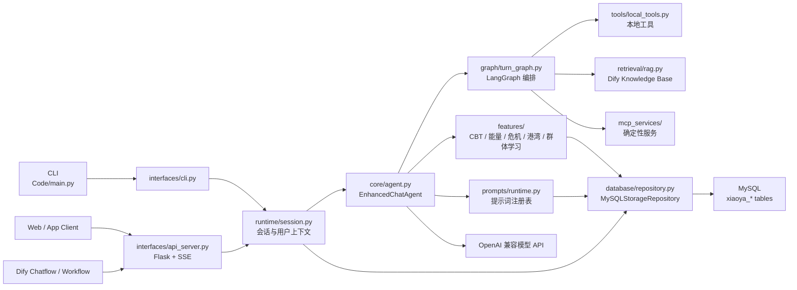
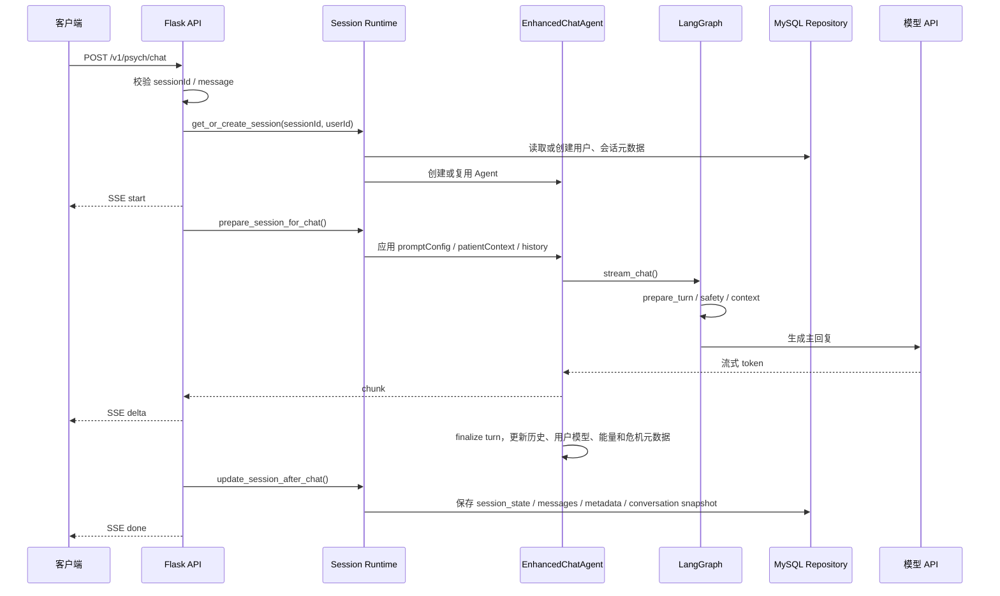

# 小芽详细设计文档

## 1. 文档范围

本文描述当前项目的运行时设计，包括接口设计、功能流程、模块划分和关键配置。项目当前形态是一个面向骨髓移植患者的中文心理陪伴智能体，提供命令行入口、Flask HTTP API、SSE 流式对话接口、Dify 工具接口、会话管理、用户心理模型、心理能量、危机判断、心之港湾练习、提示词热更新和匿名群体学习能力。

当前存储策略以 MySQL 为主。只要 `STORAGE_BACKEND=mysql`，用户历史、会话状态、用户心理模型、能量进度、危机历史、提示词注册表和群体学习缓存都通过 `Code/xiaoya_agent/database/` 中的仓储层写入数据库，不再落本地 JSON 文件。

## 2. 总体架构



核心设计原则：

- 接口层只做请求解析、响应封装和路由分发，不直接写数据库。
- 运行时层统一管理 `sessionId`、`userId`、`threadId`、会话锁、会话元数据和状态快照。
- 智能体层负责对话生成、流式输出、危机判断、用户画像更新、能量评估和长期记忆。
- 数据库代码单独放在 `Code/xiaoya_agent/database/`，业务模块只调用仓储接口，不散落 SQL。
- MySQL 模式下本地 `data/` 目录不再作为用户运行时持久化来源。

## 3. 模块划分

| 模块 | 文件 | 职责 |
|---|---|---|
| 启动入口 | `Code/main.py`、`Code/api_server.py` | 轻量入口，分别启动 CLI 和 API 服务 |
| API 接口层 | `Code/xiaoya_agent/interfaces/api_server.py` | Flask 路由、SSE 事件、Dify 请求适配、统一错误响应 |
| CLI 接口层 | `Code/xiaoya_agent/interfaces/cli.py` | 命令行对话、用户切换、手动保存、查看用户模型和练习工具 |
| 会话运行时 | `Code/xiaoya_agent/runtime/session.py` | `SessionManager`、内存会话表、会话元数据、用户历史、会话生命周期 |
| 状态快照 | `Code/xiaoya_agent/runtime/state_store.py` | 保存和恢复完整 Agent 会话状态，MySQL 模式下写入 `session_states` |
| 智能体核心 | `Code/xiaoya_agent/core/agent.py` | 对话生成、流式链路、后台分析、记忆更新、长期用户模型、持久化调用 |
| 图编排 | `Code/xiaoya_agent/graph/turn_graph.py` | LangGraph 节点化编排：准备上下文、启动后台分析、安全判断、应用上下文 |
| CBT 功能 | `Code/xiaoya_agent/features/cbt.py` | CBT 用户画像和认知行为相关结构 |
| 心理能量 | `Code/xiaoya_agent/features/energy.py` | 五维能量、成就、趋势和练习记录 |
| 危机干预 | `Code/xiaoya_agent/features/crisis.py` | 危机语义判断、危机历史、报警回调和安全提示 |
| 心之港湾 | `Code/xiaoya_agent/features/harbor.py` | 正念、冥想、音乐放松、呼吸、肌肉放松、54321 接地练习 |
| 群体学习 | `Code/xiaoya_agent/features/cohort_learning.py` | 从匿名用户心理模型聚合共性信号，写入 MySQL 缓存 |
| 提示词运行时 | `Code/xiaoya_agent/prompts/runtime.py` | profile、output mode、版本、回滚、预览和热更新 |
| 本地工具 | `Code/xiaoya_agent/tools/local_tools.py` | LangGraph / 模型工具调用适配，提供确定性上下文 |
| MCP 风格服务 | `Code/xiaoya_agent/mcp_services/` | 当前时间等确定性服务，减少模型猜测 |
| Dify 集成 | `Code/xiaoya_agent/integrations/dify.py` | Dify Chatflow/Knowledge Base 状态与适配 |
| RAG 检索 | `Code/xiaoya_agent/retrieval/rag.py` | 当前运行时只接 Dify Knowledge Base，不索引本地 `File/` |
| 结构化输出 | `Code/xiaoya_agent/llm/structured.py` | Pydantic 模型和 OpenAI 兼容结构化 JSON 输出 |
| 数据库仓储 | `Code/xiaoya_agent/database/repository.py` | MySQL 连接、建表、用户/会话/消息/缓存/提示词读写 |
| 本地 JSON 迁移 | `Code/xiaoya_agent/database/migrate_local_json.py` | 一次性把旧本地 JSON 数据导入 MySQL |
| 配置 | `Code/xiaoya_agent/config.py` | 从 `config.env` 读取模型、MySQL、RAG、Dify、危机、能量等配置 |

## 4. 核心功能流程

### 4.1 API 流式心理对话

接口：`POST /v1/psych/chat`



请求关键字段：

| 字段 | 必填 | 说明 |
|---|---:|---|
| `sessionId` | 是 | 外部会话 ID，同一个 ID 复用同一个运行时会话 |
| `message` | 是 | 用户输入 |
| `userId` / `patientId` | 否 | 用户 ID；不传时默认使用 `sessionId` |
| `patientContext.stage` | 否 | `PRETREATMENT`、`TRANSPLANT`、`RECOVERY` 等阶段 |
| `patientContext.psychEnergy` | 否 | 前端传入的能量参考值，用于推荐问题 |
| `history` | 否 | 外部传入历史，用于重建当前轮上下文 |
| `promptConfig` | 否 | 覆盖 prompt profile、output mode、system prompt 或额外指令 |

SSE 事件：

| 事件 | 说明 |
|---|---|
| `start` | 会话已准备，返回 `sessionId`、`userId`、`threadId`、提示词版本等运行时元信息 |
| `delta` | 主回复流式文本片段 |
| `done` | 完整回复、能量评估、危机评估、推荐问题、会话摘要和工具轨迹 |
| `error` | 请求处理异常时返回统一错误 |

### 4.2 Dify 阻塞式对话

接口：`POST /v1/dify/chat`

Dify 适配层会把 Dify 的字段规范化为小芽内部字段：

| Dify 字段 | 小芽字段 |
|---|---|
| `query` | `message` |
| `conversation_id` | `sessionId` |
| `user` | `userId` |
| `inputs.stage` | `patientContext.stage` |
| `inputs.psychEnergy` | `patientContext.psychEnergy` |
| `inputs.promptProfile` | `promptConfig.promptProfile` |
| `inputs.outputMode` | `promptConfig.outputMode` |

处理流程：

1. `_normalize_dify_chat_request()` 解析 Dify 请求。
2. `_run_blocking_chat_turn()` 复用同一套会话和智能体逻辑。
3. 返回普通 JSON，不使用 SSE。
4. `answer` 可直接接 Dify Answer 节点。
5. `difyOutputs` 提供扁平字段，方便 Dify IF/ELSE、变量赋值和页面展示。

### 4.3 LangGraph 单轮编排

`Code/xiaoya_agent/graph/turn_graph.py` 把单轮对话拆成四个节点：

| 节点 | 职责 |
|---|---|
| `prepare_turn` | 获取当前移植阶段、构造占位 CBT 分析、危机预判断、工具上下文和 RAG 上下文 |
| `start_background_analysis` | 按配置启动后台统一语义分析，不阻塞首 token |
| `evaluate_safety` | 合并危机信号和医疗红旗规则，必要时进入安全回应 |
| `apply_response_context` | 应用阶段变化，确定本轮 `response_type` |

安全回应优先级高于普通回复。若触发危机或医疗红旗，图编排会转入静态安全回复，并记录危机事件；否则进入模型流式生成和后续 finalize。

### 4.4 会话生命周期

会话运行时由 `SessionManager` 表示，包含：

- `session_id`：外部会话 ID。
- `user_id`：用户 ID，同一用户可跨 API/CLI/Dify 会话共享长期心理模型。
- `thread_id`：传给 LangGraph 的线程 ID，当前由安全化后的 `sessionId` 派生。
- `agent`：当前会话的 `EnhancedChatAgent`。
- `lock`：单会话重入锁，避免同一个会话并发写状态。
- `last_access`：用于内存会话过期清理。

主要流程：

1. `get_or_create_session()` 根据 `sessionId` 查找内存会话。
2. 不存在时创建兼容用的内存路径字段和 Agent；MySQL 模式不会创建用户运行时目录。
3. 从 MySQL 恢复 `session_state`、消息历史、用户心理模型和用户状态。
4. 每轮对话后调用 `update_session_after_chat()` 保存状态、消息、会话元数据和用户统一会话索引。
5. `cleanup_expired_sessions()` 清理超过 TTL 的内存对象；持久数据仍保存在 MySQL。

### 4.5 用户长期心理模型

用户长期心理模型由以下来源共同更新：

- 对话 finalize 阶段更新 `conversation_history`。
- 后台统一语义分析补充 CBT 画像、危机判断和移植情境。
- `_record_cbt_profile_signal()` 更新用户偏好、关注点、情绪和认知模式。
- `_update_memory_core()` 压缩历史为长期记忆摘要。
- `_save_psych_model()` 保存到 `xiaoya_users.psych_model_json`。

用户级数据集中保存在 `xiaoya_users`，包括：

- `psych_model_json`：长期心理模型。
- `user_state_json`：移植阶段等轻量状态。
- `energy_progress_json`：心理能量和成就。
- `crisis_history_json`：危机记录。

### 4.6 持久化流程

MySQL 模式判断由 `database_storage_enabled()` 完成。启用后：

1. 所有业务模块调用 `get_database_repository()` 获取单例仓储。
2. 仓储在第一次连接时按 `DATABASE_AUTO_INIT` 自动建表。
3. 用户、会话、消息、状态、提示词、群体学习缓存统一通过 `MySQLStorageRepository` 读写。
4. 旧的本地 JSON 路径只作为兼容和一次性迁移入口，不再作为运行时保存路径。

本地 JSON 迁移流程：

```powershell
$env:PYTHONPATH="Code"
python -m xiaoya_agent.database.migrate_local_json
```

迁移内容包括旧用户模型、旧会话状态、旧会话历史、CLI 历史、提示词注册表和群体学习缓存。

### 4.7 提示词热更新流程

提示词运行时由 `prompts/runtime.py` 管理：

1. 内置 profile 和 output mode 作为默认注册表。
2. MySQL 模式下优先读取 `xiaoya_prompt_registries.registry_json`。
3. 如果数据库中还没有注册表，会读取旧的 `data/prompt_registry.json` 作为一次性迁移来源，并写入数据库。
4. API 支持查看、更新、回滚、删除、比较和预览。
5. Agent 每轮调用 `_resolve_prompt_runtime()` 获取当前 profile、output mode 和版本信息。

### 4.8 匿名群体学习流程

群体学习由 `features/cohort_learning.py` 管理：

1. 从 `xiaoya_users.psych_model_json` 读取结构化心理模型，不读取完整聊天原文。
2. 聚合多个用户的共同关注、情绪、认知模式、有效策略、支持偏好和风险提示。
3. 满足最小用户数后生成匿名群体模型。
4. MySQL 模式下缓存到 `xiaoya_cohort_models.payload_json`。
5. 用户心理模型更新后调用 `mark_cohort_learning_dirty()`，下一次读取时按 dirty 标记和 TTL 重建。

## 5. 接口设计

### 5.1 健康检查

| 方法 | 路径 | 说明 |
|---|---|---|
| `GET` | `/health` | 返回服务健康状态、模型、配置摘要 |

### 5.2 心理对话接口

| 方法 | 路径 | 响应 | 说明 |
|---|---|---|---|
| `POST` | `/v1/psych/chat` | SSE | 主心理陪伴对话，流式返回 |
| `POST` | `/v1/psych/analyze` | JSON | 对单条输入做结构化语义分析，不写入聊天历史 |
| `POST` | `/v1/psych/recommendations` | JSON | 根据阶段、能量和情绪生成推荐问题 |

### 5.3 Dify 接口

| 方法 | 路径 | 说明 |
|---|---|---|
| `POST` | `/v1/dify/chat` | Dify 自定义工具主入口，返回 `answer` 和 `difyOutputs` |
| `GET` | `/v1/dify/openapi.yaml` | Dify 可导入的 OpenAPI 描述 |
| `GET` | `/v1/dify/status` | 当前 Dify 接管状态 |
| `GET` | `/v1/dify/options` | Dify 可用阶段、提示词 profile、输出模式和变量说明 |
| `POST` | `/v1/dify/recommendations` | 给 Dify 流程使用的推荐问题 |
| `POST` | `/v1/dify/context` | 给 Dify 页面或变量节点读取当前会话上下文 |
| `POST` | `/v1/dify/grounding` | 返回接地练习结构化内容 |
| `POST` | `/v1/dify/harbor` | 返回心之港湾练习结构化内容 |

### 5.4 会话接口

| 方法 | 路径 | 说明 |
|---|---|---|
| `GET` | `/v1/sessions` | 会话列表 |
| `POST` | `/v1/sessions` | 创建会话元数据 |
| `GET` | `/v1/sessions/<sessionId>` | 查看会话详情 |
| `PATCH` | `/v1/sessions/<sessionId>` | 重命名会话 |
| `DELETE` | `/v1/sessions/<sessionId>` | 删除会话及其状态和消息 |
| `GET` | `/v1/sessions/<sessionId>/history` | 读取会话历史，可选 `includeSystem=true` |
| `POST` | `/v1/sessions/<sessionId>/auto-name` | 根据首条用户消息自动命名 |
| `GET` | `/v1/sessions/<sessionId>/state` | 查看当前内存状态 |
| `PATCH` | `/v1/sessions/<sessionId>/state` | 更新阶段状态 |
| `GET` | `/v1/sessions/<sessionId>/phase` | 查看移植阶段 |
| `PATCH` | `/v1/sessions/<sessionId>/phase` | 设置移植阶段 |
| `GET` | `/v1/sessions/<sessionId>/psych-model` | 查看当前会话内存中的用户心理模型 |
| `GET` | `/v1/sessions/<sessionId>/energy` | 查看心理能量报告 |
| `GET` | `/v1/sessions/<sessionId>/achievements` | 查看成就统计 |
| `GET` | `/v1/sessions/<sessionId>/progress` | 查看综合进度 |
| `GET` | `/v1/sessions/<sessionId>/crisis-report` | 查看危机历史报告 |
| `GET/POST` | `/v1/sessions/<sessionId>/grounding` | 查看或记录接地练习 |
| `GET/POST` | `/v1/sessions/<sessionId>/harbor` | 查看或记录心之港湾练习 |
| `POST` | `/v1/sessions/<sessionId>/save` | 手动保存当前会话状态 |
| `POST` | `/v1/sessions/<sessionId>/reset` | 重置当前会话和当前用户运行时数据 |

### 5.5 用户接口

| 方法 | 路径 | 说明 |
|---|---|---|
| `GET` | `/v1/users` | 用户列表和会话数量 |
| `GET` | `/v1/users/<userId>/psych-model` | 查看用户长期心理模型 |
| `GET` | `/v1/users/<userId>/conversations` | 查看用户统一会话索引 |
| `GET` | `/v1/users/<userId>/history` | `conversations` 的兼容别名 |
| `DELETE` | `/v1/users/<userId>` | 删除用户、会话、消息、状态和聚合历史 |

### 5.6 提示词接口

| 方法 | 路径 | 说明 |
|---|---|---|
| `GET` | `/v1/prompts` | 查看提示词注册表 |
| `POST` | `/v1/prompts/reload` | 清空内存缓存并重载注册表 |
| `PATCH` | `/v1/prompts/settings` | 设置默认 profile 和 output mode |
| `GET/PUT/DELETE` | `/v1/prompts/profiles/<key>` | 查看、更新、删除 profile |
| `POST` | `/v1/prompts/profiles/<key>/rollback` | 回滚 profile 到指定版本 |
| `POST` | `/v1/prompts/profiles/<key>/preview` | 预览 profile 修改效果 |
| `GET/PUT/DELETE` | `/v1/prompts/output-modes/<key>` | 查看、更新、删除输出模式 |
| `POST` | `/v1/prompts/output-modes/<key>/rollback` | 回滚输出模式 |
| `POST` | `/v1/prompts/output-modes/<key>/preview` | 预览输出模式 |
| `GET` | `/v1/prompts/compare` | 比较提示词版本差异 |
| `POST` | `/v1/prompts/preview` | 通用预览入口 |

### 5.7 工具与扩展接口

| 方法 | 路径 | 说明 |
|---|---|---|
| `GET/POST` | `/v1/knowledge/search` | Dify Knowledge Base 检索调试 |
| `GET/POST` | `/v1/rag/search` | `knowledge/search` 的兼容别名 |
| `GET` | `/v1/mcp/services` | 查看可用确定性服务 |
| `GET/POST` | `/v1/mcp/invoke` | 调用确定性服务 |
| `GET` | `/v1/harbor/catalog` | 查看心之港湾目录 |
| `POST` | `/v1/harbor/start` | 生成一次心之港湾练习，不绑定具体会话 |
| `GET` | `/v1/cohort-learning` | 查看匿名群体学习模型 |
| `POST` | `/v1/cohort-learning/rebuild` | 强制重建匿名群体学习模型 |
| `GET` | `/v1/capabilities` | 输出当前服务能力清单 |

## 6. 配置设计

主要配置来自根目录 `config.env`，由 `Config` 类读取。

| 配置 | 说明 |
|---|---|
| `API_BASE_URL`、`API_KEY`、`MODEL_NAME` | OpenAI 兼容模型服务配置 |
| `STORAGE_BACKEND=mysql` | 开启 MySQL 存储 |
| `DATABASE_URL` | 可选 MySQL 连接串，优先级高于分项配置 |
| `MYSQL_HOST`、`MYSQL_PORT`、`MYSQL_USER`、`MYSQL_PASSWORD`、`MYSQL_DATABASE` | MySQL 分项连接配置 |
| `DATABASE_TABLE_PREFIX` | 表名前缀，当前为 `xiaoya_` |
| `DATABASE_AUTO_INIT` | 是否自动建表 |
| `AGENT_GRAPH_ENABLED` | 是否启用 LangGraph 编排 |
| `AGENT_TOOLS_ENABLED` | 是否启用本地工具层 |
| `AGENT_MODEL_TOOL_CALLING_ENABLED` | 是否允许模型按需工具调用 |
| `PROMPT_PROFILE`、`OUTPUT_MODE` | 默认提示词 profile 和输出模式 |
| `COHORT_LEARNING_ENABLED` | 是否启用匿名群体学习 |
| `RAG_BACKEND=dify` | 当前运行时 RAG 后端 |
| `DIFY_*` | Dify API 和知识库配置 |
| `SESSION_STATE_ENABLED` | 是否保存完整会话状态快照 |
| `AUTO_SAVE_PROGRESS` | 每轮是否自动保存进度 |
| `POST_STREAM_ANALYSIS_WAIT_SECONDS` | 流式结束后等待后台分析的时间 |

## 7. 并发与一致性

- 内存会话由全局 `agent_sessions` 字典管理，使用 `agent_sessions_lock` 保护创建和查找。
- 单个会话内部使用 `SessionManager.lock`，避免同一个 `sessionId` 同时写历史和状态。
- 数据库连接默认 `autocommit=True`，仓储方法以单方法为一致性边界。
- 消息保存采用“先删该会话消息，再按 index 批量插入”的方式，保证 `message_index` 连续且唯一。
- 用户、会话、会话状态、会话聚合索引都使用 upsert，重复保存同一轮不会创建重复主记录。
- 删除用户和删除会话由仓储层手动级联删除相关消息、状态和聚合历史。

## 8. 错误处理

接口层统一返回：

| 类型 | HTTP 状态 | 场景 |
|---|---:|---|
| `invalid_request` | 400 | 必填字段缺失、阶段值非法、JSON 请求体非法 |
| `not_found` | 404 | 会话、用户或提示词不存在 |
| `internal_error` | 500 | 模型调用、数据库、运行时异常 |

SSE 场景下，运行时异常会通过 `event: error` 返回，不会直接中断为普通 JSON。

## 9. 隐私与安全边界

- 小芽提供心理陪伴和风险提示，不替代医生、护士、心理治疗师或紧急救援。
- 危机和医疗红旗场景优先给安全提示，必要时触发报警回调。
- 用户长期数据按 `userId` 隔离；同一用户可跨多个会话共享心理模型。
- 匿名群体学习只读取结构化心理模型字段，不读取完整聊天原文，不把具体用户 ID 写入群体模型。
- MySQL 模式下用户运行时数据不再写入本地 JSON 文件。
