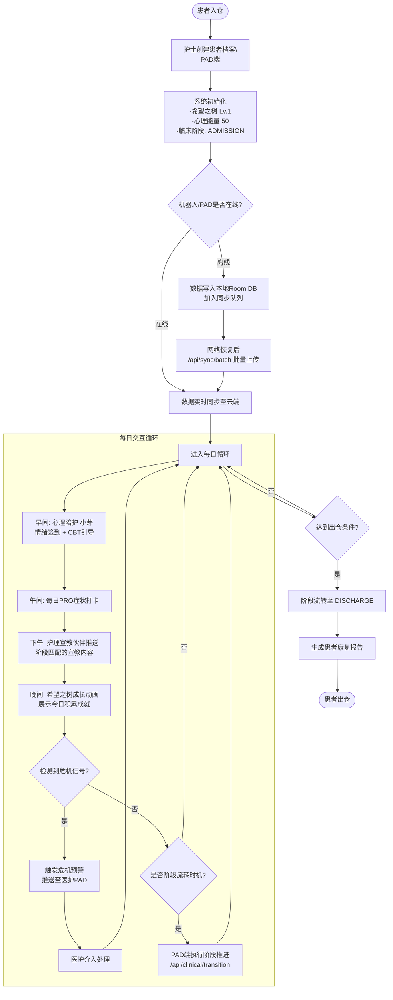
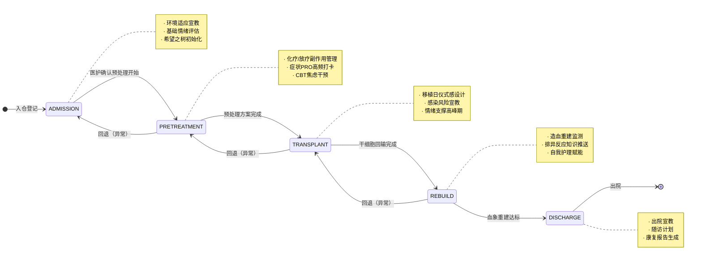
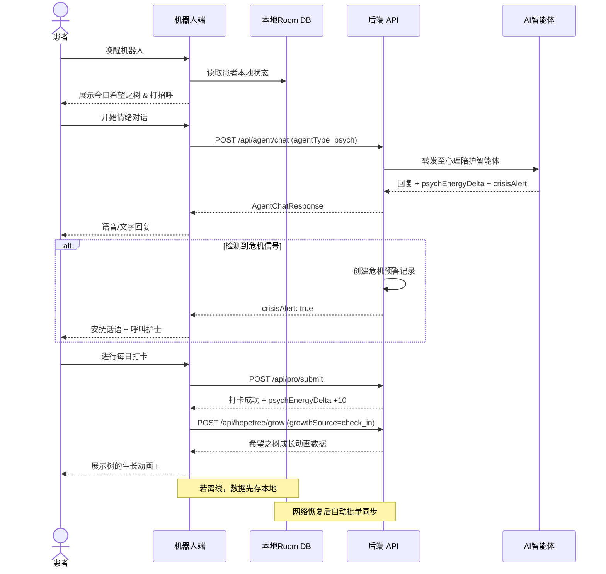
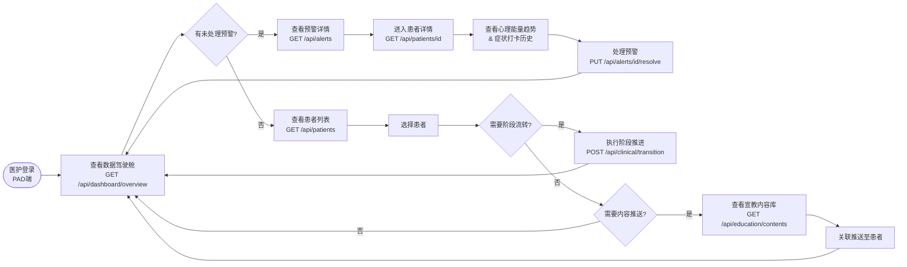
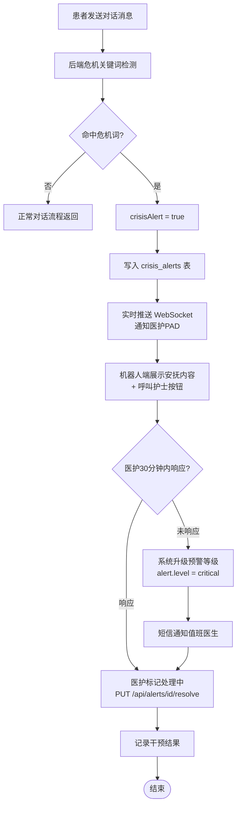
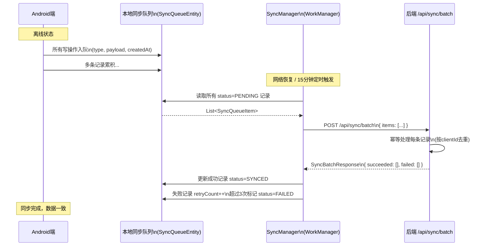

## 业务流程图

### 1. 系统整体业务流程



---

### 2. 临床五阶段路径流转



---

### 3. 患者端（机器人）每日交互流程



---

### 4. 医护端（PAD）操作流程



---

### 5. 危机干预流程



---

### 6. 离线数据同步流程



---

## 三端架构概览

```
┌──────────────────────────────────────────────────────────────────┐
│                        三端功能分区                               │
├──────────────────┬───────────────────┬───────────────────────────┤
│   患者端（机器人）│   医护端（PAD）    │   运维端（Web后台）        │
│   Android Kotlin  │   Android/Web Vue │   Vue3 + Element Plus     │
├──────────────────┼───────────────────┼───────────────────────────┤
│ · 情绪对话（小芽）│ · 数据驾驶舱       │ · 宣教内容管理（CRUD）     │
│ · 护理宣教推送   │ · 患者列表总览     │ · 患者批量导入/导出        │
│ · PRO每日打卡    │ · 阶段流转操作     │ · 系统配置管理             │
│ · 希望之树动画   │ · 危机预警处理     │ · 数据统计报表             │
│ · 冥想/呼吸练习  │ · 打卡历史查看     │ · 用户权限管理             │
│ · 离线优先架构   │ · 推送内容给患者   │ · 审计日志查询             │
└──────────────────┴───────────────────┴───────────────────────────┘
                            ↕ HTTP REST API
┌──────────────────────────────────────────────────────────────────┐
│              Spring Boot 后端 (localhost:8080)                    │
│  MySQL 8.x — xinya_dtx 数据库                                    │
└──────────────────────────────────────────────────────────────────┘
                            ↕ HTTP / SDK
┌──────────────────────────────────────────────────────────────────┐
│             Python AI 智能体（独立部署，由专人对接）              │
│   小芽-心理（CBT + 危机检测）  ·  小护士-护理（阶段知识推送）    │
└──────────────────────────────────────────────────────────────────┘
```

---